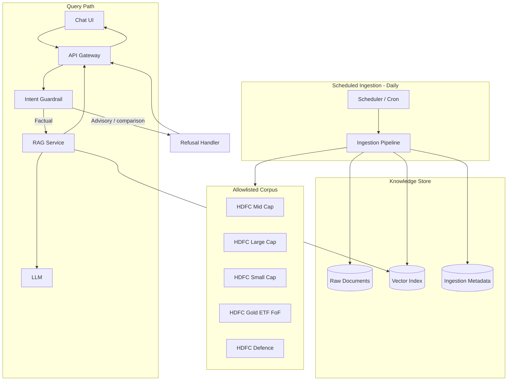
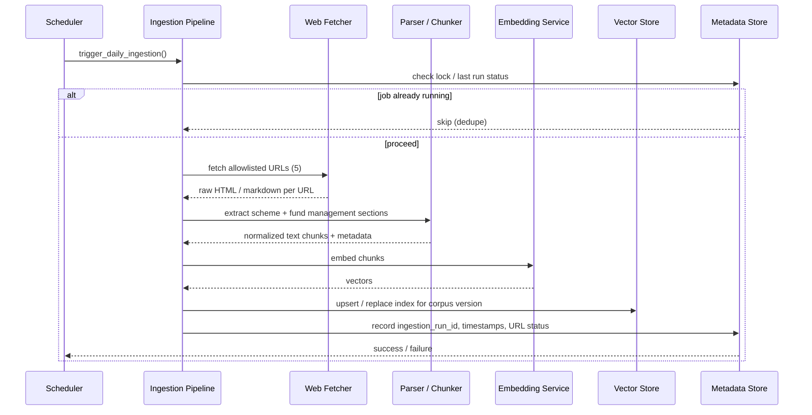
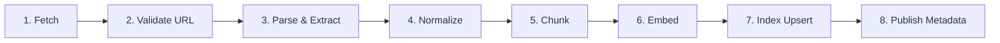
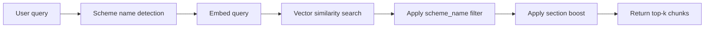
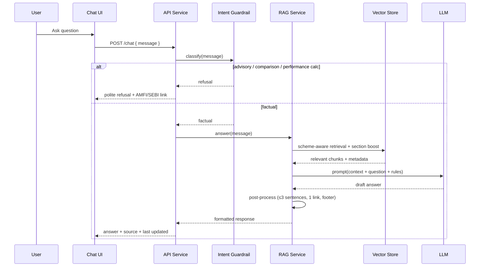
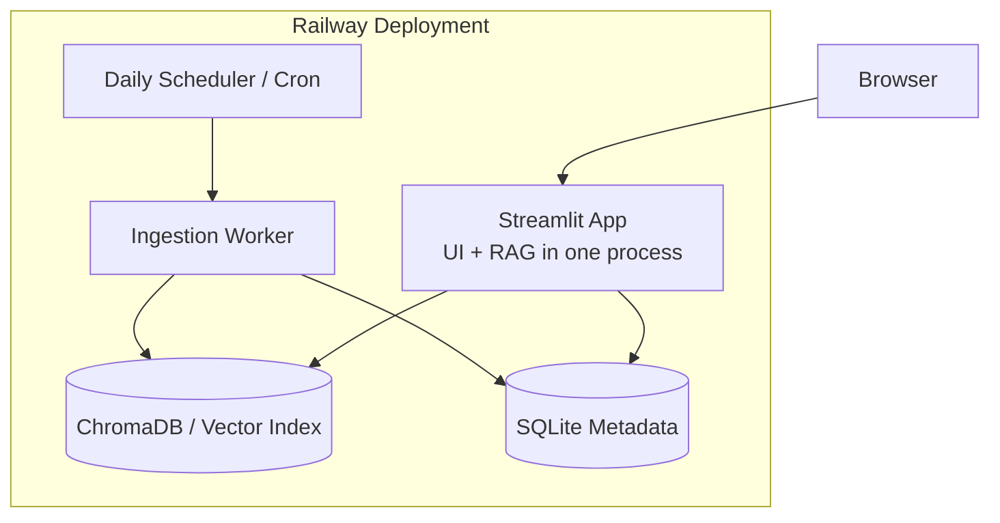
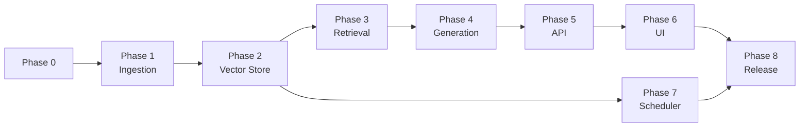

# Architecture: Mutual Fund FAQ Assistant

This document describes the system architecture for the **facts-only Mutual Fund FAQ Assistant** defined in [problemStatement.md](./problemStatement.md). The design is lightweight, RAG-based, and scoped to **5 HDFC fund pages on Groww**, with a **daily scheduler** that keeps the knowledge base fresh.

> **Deployment note:** The app now ships as a **single Streamlit service** (`streamlit_app.py`)
> where the UI and RAG pipeline run in one Python process — the browser talks only to
> Streamlit, which calls `rag.generator.answer()` in-process (no separate API, no CORS).
> The original split **Next.js (`ui/`) + FastAPI (`api/`)** stack is retained for reference
> and described as the *legacy* path. See [deployment-plan.md](./deployment-plan.md) and
> [streamlit.md](./streamlit.md). The component diagrams below show the logical query path,
> which is identical in both deployments; only the transport (HTTP API vs in-process call)
> differs.

---

## 1. Design Principles

| Principle | Implication |
|-----------|-------------|
| **Accuracy over intelligence** | Answers are grounded in retrieved chunks; the LLM does not freestyle financial facts |
| **Facts-only** | Advisory, comparative, and performance-calculation queries are refused before retrieval |
| **Source transparency** | Every answer includes exactly one citation link and a last-updated footer |
| **Minimal surface area** | No auth, no PII collection, no portfolio features |
| **Allowlisted corpus** | Ingestion and retrieval operate only on the 5 configured Groww URLs |
| **Fresh data** | A scheduler re-runs ingestion daily so NAV, AUM, expense ratio, and fund manager changes are reflected |

---

## 2. High-Level Architecture



The system splits into two paths:

1. **Offline ingestion path** — triggered daily by the scheduler; fetches, parses, chunks, embeds, and indexes corpus documents.
2. **Online query path** — user question → guardrail check → RAG retrieval + generation → formatted response.

---

## 3. Component Overview

| Component | Responsibility | Runs |
|-----------|----------------|------|
| **Scheduler** | Triggers ingestion on a fixed daily schedule | Built in Phase 7; background / cron |
| **Ingestion Pipeline** | Fetch, clean, chunk, embed, and upsert corpus data | Phases 1–2; daily + on-demand |
| **Vector Store** | Semantic search over document chunks | Built in Phase 2; always on |
| **Retriever** | Scheme-aware retrieval with section boosting over the vector index | Built in Phase 3; used per request |
| **Metadata Store** | Tracks source URLs, last-ingested timestamps, chunk versions | Built in Phase 2; always on |
| **API Service** | Exposes `/chat` and health endpoints | Built in Phase 5; always on |
| **Intent Guardrail** | Classifies advisory vs factual queries | Built in Phase 5; per request |
| **RAG Service** | Calls Phase 3 retriever, builds grounded prompts, post-processes answers | Built in Phase 4; runs per request |
| **LLM** | Generates concise answer from retrieved context | Per request |
| **Refusal Handler** | Returns compliant refusal + educational link | Built in Phase 5; per request |
| **Chat UI** | Welcome message, example questions, disclaimer, chat | Built in Phase 6; always on |

---

## 4. Scheduler (Daily Ingestion Trigger)

### 4.1 Purpose

Fund pages change over time — NAV, AUM, expense ratio, exit load, and fund manager tenure can all update. The scheduler ensures the vector index does not serve stale facts.

### 4.2 Behavior

| Setting | Recommended default |
|---------|---------------------|
| **Frequency** | Once per day |
| **Schedule** | `0 6 * * *` (06:00 IST) — after typical NAV publish window |
| **Trigger mode** | Scheduled only in MVP; manual re-run supported for debugging |
| **Concurrency** | Single ingestion job at a time (no overlapping runs) |
| **Failure policy** | Retry up to 3 times with exponential backoff; keep previous index on failure |

### 4.3 Scheduler Options

| Option | Pros | Best for |
|--------|------|----------|
| **OS cron** | Simple, no extra dependency | Local dev / single-server deploy |
| **APScheduler** | In-process Python scheduling | Lightweight app-embedded scheduler |
| **Celery Beat** | Distributed, production-grade | Multi-worker deployments |
| **Cloud scheduler** (e.g., Cloud Scheduler, EventBridge) | Managed, reliable | Cloud-hosted production |

**MVP recommendation:** APScheduler embedded in the ingestion worker, with an equivalent cron entry documented for production.

### 4.4 Scheduler Flow



### 4.5 Ingestion Job Contract

```json
{
  "job_id": "ingest-2026-06-17",
  "triggered_by": "scheduler",
  "scheduled_at": "2026-06-17T06:00:00+05:30",
  "urls": [
    "https://groww.in/mutual-funds/hdfc-mid-cap-fund-direct-growth",
    "https://groww.in/mutual-funds/hdfc-large-cap-fund-direct-growth",
    "https://groww.in/mutual-funds/hdfc-small-cap-fund-direct-growth",
    "https://groww.in/mutual-funds/hdfc-gold-etf-fund-of-fund-direct-plan-growth",
    "https://groww.in/mutual-funds/hdfc-defence-fund-direct-growth"
  ],
  "status": "success | partial | failed",
  "documents_processed": 5,
  "chunks_written": 120,
  "completed_at": "2026-06-17T06:04:32+05:30"
}
```

---

## 5. Ingestion Pipeline

### 5.1 Stages



#### Stage 1 — Fetch

- HTTP GET each allowlisted Groww fund page
- Respect rate limits (sequential fetch, 1–2s delay between requests)
- Store raw response for audit/debug

#### Stage 2 — Validate URL

- Reject any URL not in the allowlist
- Fail the job if zero URLs succeed; mark `partial` if some URLs fail

#### Stage 3 — Parse & Extract

**Section extraction (Phase 1):** Tag content into the following `section_type` values. Each section is parsed, normalized, and chunked separately — never mix sections in a single chunk.

| `section_type` | Fields extracted | Groww page signals |
|----------------|------------------|-------------------|
| `overview` | Scheme name, category, risk, NAV, AUM, riskometer | Fund header, key metrics card |
| `expense_ratio` | Expense ratio (direct plan) | "Expense ratio" label |
| `exit_load` | Exit load rules, stamp duty on redemption | "Exit load", "Exit load, stamp duty and tax" |
| `minimum_investment` | Min SIP, min 1st investment, min 2nd investment | "Minimum investments", "Min. for SIP" |
| `benchmark` | Benchmark index name | "Fund benchmark", benchmark field |
| `tax` | Tax implications (LTCG, STCG, holding period rules) | "Tax implication" under charges section |
| `fund_management` | Manager name, tenure, education, experience, other schemes | "Fund management" block |
| `investment_objective` | Investment objective statement | "Investment Objective" |
| `fund_house` | AMC name, website, launch date, address | "Fund house" block |

**Parser rules:**

- One `section_type` per chunk — do not combine `expense_ratio` and `exit_load` in the same chunk
- If a Groww heading maps to multiple types, split into separate section records (e.g. tax vs exit_load)
- `fund_management` blocks must stay intact — never split mid-manager profile
- Missing section → log warning; do not fail entire URL unless zero sections extracted

#### Stage 4 — Normalize

- Strip navigation, ads, and unrelated page chrome
- Convert to clean plain text or markdown
- Attach metadata: `source_url`, `scheme_name`, `section_type`, `ingested_at`

#### Stage 5 — Chunk

**Strategy:** Section-first (see [implementation-plan.md Phase 1](./implementation-plan.md#chunking-strategy-phase-1)).

| Rule | Detail |
|------|--------|
| Default | 1 chunk per parsed section (8 section types) |
| `fund_management` | 1 chunk per manager profile; strip "Also manages" lists |
| Overlap | 0 tokens for this corpus (`chunk_overlap_tokens: 0`) |
| Fallback | Split on paragraphs only if a section exceeds 600 tokens |
| Header | Prepend `Scheme:` and `Section:` to every chunk body |

Expected corpus size: **~51 chunks** across 5 schemes (11 for HDFC Defence, 10 each for others).

#### Stage 6 — Embed

- Generate embeddings via the chosen embedding model
- Use a consistent model version across ingestion and query time

#### Stage 7 — Index Upsert

- Write embeddings to the vector store
- Replace previous corpus version atomically (blue/green index swap) to avoid partial reads

#### Stage 8 — Publish Metadata

- Persist `last_updated_from_sources` date used in response footers
- Expose per-URL ingestion status for monitoring

---

## 6. Knowledge Store

### 6.1 Vector Store

Stores embedded chunks for semantic retrieval.

| Field | Description |
|-------|-------------|
| `chunk_id` | Unique chunk identifier |
| `embedding` | Vector representation |
| `text` | Chunk content |
| `source_url` | One of the 5 allowlisted Groww URLs |
| `scheme_name` | e.g., `HDFC Defence Fund Direct Growth` |
| `section_type` | `overview`, `expense_ratio`, `exit_load`, `minimum_investment`, `benchmark`, `tax`, `fund_management`, `investment_objective`, `fund_house` |
| `ingested_at` | Timestamp of last ingestion run |

**MVP options:** ChromaDB (local), FAISS (file-based), or pgvector (Postgres).

### 6.2 Metadata Store

Tracks ingestion runs and per-source freshness.

| Table / record | Purpose |
|----------------|---------|
| `ingestion_runs` | Job history, status, duration, error logs |
| `source_documents` | URL, scheme name, last successful fetch time |
| `corpus_version` | Active index version pointer |

### 6.3 Raw Document Store (optional)

- Save fetched HTML/markdown per run for debugging and reprocessing
- Not required for query-time serving

### 6.4 Scheme-Aware Retrieval with Section Boosting

Built in **Phase 3** after the Phase 2 vector store is ready. The retriever layer sits between the vector index and the Phase 4 RAG generation service.

#### Purpose

Improve retrieval accuracy by:

1. **Scheme-aware filtering** — when a user mentions a fund, search only that scheme's chunks
2. **Section boosting** — rank certain section types higher based on query intent

#### Retrieval Pipeline



#### Step 1 — Scheme Name Detection

Detect which of the 5 schemes the user is asking about via string matching against configured scheme names and common aliases.

| Scheme | Example aliases |
|--------|-----------------|
| HDFC Mid Cap Fund Direct Growth | mid cap, hdfc mid cap |
| HDFC Large Cap Fund Direct Growth | large cap, hdfc large cap |
| HDFC Small Cap Fund Direct Growth | small cap, hdfc small cap |
| HDFC Gold ETF Fund of Fund Direct Plan Growth | gold etf, gold fund of fund |
| HDFC Defence Fund Direct Growth | defence, defense, hdfc defence |

If no scheme is detected, search across all 5 schemes (no filter applied).

#### Step 2 — Vector Similarity Search

| Parameter | Value |
|-----------|-------|
| **top-k** | 4–6 chunks (fetch more before boosting, e.g. k=10) |
| **Similarity threshold** | 0.7 — discard low-confidence matches |

#### Step 3 — Scheme-Aware Metadata Filter

When a scheme is detected, filter (or hard-boost) chunks where `scheme_name` matches the detected scheme. This prevents cross-scheme noise — e.g., returning HDFC Mid Cap exit load when the user asked about HDFC Defence.

#### Step 4 — Section Boosting

After similarity search, re-rank chunks by boosting scores for matching `section_type` values based on query keywords.

| Query signals | Boosted `section_type` | Boost weight |
|---------------|------------------------|--------------|
| manager, manages, tenure, since when, education, experience, qualification | `fund_management` | +0.15 |
| expense ratio | `expense_ratio` | +0.15 |
| exit load, stamp duty, redemption charge | `exit_load` | +0.15 |
| min SIP, minimum investment, min investment | `minimum_investment` | +0.15 |
| benchmark, benchmark index | `benchmark` | +0.15 |
| tax, LTCG, STCG, tax implication | `tax` | +0.15 |
| investment objective, objective of the scheme | `investment_objective` | +0.15 |
| NAV, AUM, risk, riskometer, category | `overview` | +0.10 |
| AMC, launch date, fund house | `fund_house` | +0.10 |

Final score = `similarity_score + section_boost` (capped at 1.0). Return top-k after re-ranking.

#### Retriever Interface

```python
# rag/retriever.py  (built in Phase 3)
def retrieve(query: str, top_k: int = 5) -> list[RetrievedChunk]:
    scheme = detect_scheme(query)          # scheme-aware
    candidates = vector_store.search(      # similarity search
        query, top_k=10,
        scheme_filter=scheme,
    )
    return apply_section_boost(            # section boosting
        query, candidates, top_k=top_k
    )
```

#### Phase 3 Exit Tests (retrieval)

| Test query | Expected top chunk |
|------------|-------------------|
| "expense ratio HDFC Defence Fund" | `expense_ratio` chunk for HDFC Defence |
| "Who manages HDFC Mid Cap Fund?" | `fund_management` chunk for HDFC Mid Cap |
| "exit load HDFC Small Cap" | `exit_load` chunk for HDFC Small Cap |
| "benchmark HDFC Large Cap" | `benchmark` chunk for HDFC Large Cap |
| "minimum SIP HDFC Gold ETF" | `minimum_investment` chunk for HDFC Gold ETF FoF |
| "tax implication HDFC Defence" | `tax` chunk for HDFC Defence |
| "investment objective HDFC Defence" | `investment_objective` chunk for HDFC Defence |

---

## 7. Query Path (RAG + Guardrails)

### 7.1 End-to-End Query Flow



### 7.2 Intent Guardrail

Runs **before** retrieval to avoid generating advisory content.

| Query type | Examples | Action |
|------------|----------|--------|
| **Factual** | "What is the expense ratio of HDFC Defence Fund?" | Proceed to RAG |
| **Fund management** | "Who manages HDFC Mid Cap Fund?" | Proceed to RAG |
| **Advisory** | "Should I invest in this fund?" | Refuse |
| **Comparison** | "Which fund is better?" | Refuse |
| **Performance calc** | "What returns will I get in 5 years?" | Refuse or link to source page only |

**Implementation options:**

- Rule-based keyword/pattern matching (MVP)
- Lightweight classifier (prompt or fine-tuned model)

### 7.3 Retrieval

Retrieval is implemented in **Phase 3** as scheme-aware retrieval with section boosting (see [§6.4](#64-scheme-aware-retrieval-with-section-boosting)). The RAG generation service in **Phase 4** **consumes** the retriever — it does not reimplement search logic.

| Parameter | Value |
|-----------|-------|
| **top-k** | 4–6 chunks |
| **Similarity threshold** | 0.7 — discard low-confidence matches |
| **Scheme-aware filter** | Filter by `scheme_name` when detected in query |
| **Section boost** | Re-rank by `section_type` based on query keywords |

### 7.4 Generation Rules (LLM Prompt Contract)

The LLM receives retrieved chunks and must:

1. Answer using **only** provided context
2. Limit output to **≤ 3 sentences**
3. Include **exactly one** source URL (from retrieved metadata)
4. Append footer: `Last updated from sources: <date>` from ingestion metadata
5. Refuse if context is insufficient — do not hallucinate

### 7.5 Response Envelope

```json
{
  "answer": "Priya Ranjan has been managing HDFC Defence Fund Direct Growth since April 2025. He holds a B.E. in Computer Science and a PGDBM in Finance.",
  "source_url": "https://groww.in/mutual-funds/hdfc-defence-fund-direct-growth",
  "last_updated_from_sources": "2026-06-17",
  "disclaimer": "Facts-only. No investment advice.",
  "refused": false
}
```

**Refusal envelope:**

```json
{
  "answer": "I can only answer factual questions about mutual fund schemes. I cannot provide investment advice or recommend funds.",
  "educational_link": "https://www.amfiindia.com/investor/knowledge-center-info",
  "disclaimer": "Facts-only. No investment advice.",
  "refused": true
}
```

---

## 8. API Layer

### 8.1 Endpoints

| Method | Path | Description |
|--------|------|-------------|
| `POST` | `/chat` | Accept user question, return answer or refusal |
| `GET` | `/health` | Liveness check |
| `GET` | `/corpus/status` | Last ingestion time, corpus version, per-URL status |
| `POST` | `/ingest/run` | Manual ingestion trigger (dev/admin only) |

### 8.2 `/chat` Request / Response

**Request:**

```json
{
  "message": "What is the minimum SIP for HDFC Gold ETF Fund of Fund?"
}
```

**Response:** See response envelope in §7.5.

### 8.3 Error Handling

| Error | HTTP | Behavior |
|-------|------|----------|
| Empty message | 400 | Validation error |
| Retrieval miss | 200 | "I could not find this information in my sources." + no hallucination |
| LLM timeout | 503 | Retry message |
| Stale corpus (> 48h) | 200 | Answer with warning in logs; scheduler alert fired |

---

## 9. Chat UI

Minimal frontend aligned with the problem statement. The primary implementation is a
**Streamlit app** (`streamlit_app.py`); a legacy Next.js UI lives under `ui/`.

### 9.1 UI Elements

| Element | Content |
|---------|---------|
| **Welcome message** | Explains facts-only scope and supported schemes (shown when chat is empty) |
| **Disclaimer** | `Facts-only. No investment advice.` (sticky banner at top) |
| **Example questions (3)** | Mix of scheme + fund management queries; auto-send on click |
| **Back to home** | Resets the conversation and returns to the welcome screen; shown only once a chat has started |
| **Chat input** | Free-text question |
| **Response card** | Answer, source link, last-updated footer |
| **Refusal card** | Refusal message + AMFI educational link |

### 9.1.1 Streamlit Session State

The Streamlit UI is stateful per browser session:

| Key | Purpose |
|-----|---------|
| `messages` | Ordered chat history (`user` / `assistant` entries, each assistant entry holds the `RAGResponse`) |
| `@st.cache_resource` warmup | Loads embedding models + LLM client once per process, shared across sessions |

**Back to home** clears `messages`, which re-renders the welcome block, scheme list, and
example chips.

### 9.2 Suggested Example Questions

1. "What is the expense ratio of HDFC Defence Fund Direct Growth?"
2. "What is the exit load on HDFC Mid Cap Fund Direct Growth?"
3. "Who manages HDFC Large Cap Fund Direct Growth?"

### 9.3 UI-to-RAG Integration

**Streamlit (current):**

- `streamlit_app.py` calls `stapp.chat_handler.handle_message()` in-process
- `handle_message()` runs the intent guardrail, then `rag.generator.answer()`
- Renders `answer`, clickable `source_url`, and `last_updated_from_sources`
- Shows disclaimer on every response

**Legacy Next.js:**

- Frontend calls `POST /chat` (proxied same-origin through `ui/app/api/[...path]/route.ts`)
- Same render contract using the JSON response envelope (§7.5)

---

## 10. Corpus Configuration

### 10.1 Allowlisted Sources

| # | Scheme | URL |
|---|--------|-----|
| 1 | HDFC Mid Cap Fund Direct Growth | https://groww.in/mutual-funds/hdfc-mid-cap-fund-direct-growth |
| 2 | HDFC Large Cap Fund Direct Growth | https://groww.in/mutual-funds/hdfc-large-cap-fund-direct-growth |
| 3 | HDFC Small Cap Fund Direct Growth | https://groww.in/mutual-funds/hdfc-small-cap-fund-direct-growth |
| 4 | HDFC Gold ETF Fund of Fund Direct Plan Growth | https://groww.in/mutual-funds/hdfc-gold-etf-fund-of-fund-direct-plan-growth |
| 5 | HDFC Defence Fund Direct Growth | https://groww.in/mutual-funds/hdfc-defence-fund-direct-growth |

### 10.2 Supported Query Domains

| `section_type` | Example queries |
|----------------|-----------------|
| `overview` | NAV, AUM, risk classification, category |
| `expense_ratio` | "What is the expense ratio?" |
| `exit_load` | "What is the exit load?" |
| `minimum_investment` | "What is the minimum SIP?" |
| `benchmark` | "What is the benchmark index?" |
| `tax` | "What are the tax implications?" |
| `fund_management` | Manager name, tenure, education, experience |
| `investment_objective` | "What is the investment objective?" |
| `fund_house` | AMC details, launch date |

---

## 11. Suggested Tech Stack (MVP)

| Layer | Suggested choice | Alternatives |
|-------|------------------|--------------|
| **Language** | Python 3.11+ | — |
| **App / Frontend** | **Streamlit** (UI + RAG in one process) | Next.js + FastAPI (legacy) |
| **API framework** (legacy) | FastAPI | Flask |
| **Scheduler** | APScheduler | cron, Celery Beat |
| **Fetcher** | `httpx` + BeautifulSoup / Playwright | Scrapy |
| **Embeddings** | BGE (`BAAI/bge-small/large-en-v1.5`, local) | OpenAI `text-embedding-3-small` |
| **Vector DB** | ChromaDB | FAISS, pgvector |
| **LLM** | Groq `llama-3.1-8b-instant` / `llama-3.3-70b-versatile` | GPT-4o-mini, local OSS |
| **Metadata DB** | SQLite | PostgreSQL |
| **Hosting** | Railway (Streamlit) | Vercel + Railway (legacy split) |
| **Config** | `.env` + YAML allowlist | — |

---

## 12. Deployment View

### 12.0 Current: Single Streamlit Service (Railway)



The browser connects directly to the Streamlit app (same origin). The app imports the RAG
pipeline and calls it in-process, so there is no separate API hop and no CORS.

### 12.1 Process Layout

**Current (Streamlit):**

| Process | Description |
|---------|-------------|
| `streamlit-app` | Serves the UI **and** runs the RAG pipeline in-process (`streamlit run streamlit_app.py`) |
| `ingestion-worker` | Scheduler + ingestion pipeline (`python -m scheduler --once` via cron) |

Both share the `data/` volume (ChromaDB + SQLite). The Streamlit process is the only
public-facing service.

**Legacy (split stack):**

| Process | Description |
|---------|-------------|
| `web-ui` | Next.js frontend on Vercel (proxies to the API) |
| `api-server` | FastAPI serving `/chat` and status endpoints on Railway |
| `ingestion-worker` | Scheduler + ingestion pipeline |

All processes can run on a single machine for MVP.

---

## 13. Security & Compliance

| Area | Measure |
|------|---------|
| **PII** | No collection of PAN, Aadhaar, account numbers, OTP, email, or phone |
| **Auth** | No user authentication in MVP |
| **Source allowlist** | Ingestion hard-rejects non-allowlisted URLs |
| **Advisory block** | Intent guardrail before retrieval |
| **Audit** | Log query type (factual/refused), source URL cited, ingestion run IDs |
| **Secrets** | API keys in environment variables only |

---

## 14. Observability

| Metric | Purpose |
|--------|---------|
| `ingestion_run_duration_seconds` | Track pipeline health |
| `ingestion_run_status` | success / partial / failed |
| `urls_failed_count` | Per-run fetch failures |
| `corpus_last_updated_timestamp` | Freshness monitoring |
| `query_refusal_rate` | Guardrail effectiveness |
| `retrieval_hit_rate` | Retrieval quality |
| `llm_latency_seconds` | Serving performance |

**Alerts:**

- Ingestion failed 2 consecutive days
- Corpus older than 48 hours
- Retrieval hit rate drops below threshold

---

## 15. Directory Structure (Proposed)

```
rag-project/
├── docs/
│   ├── problemStatement.md
│   └── architecture.md
├── config/
│   └── corpus.yaml              # allowlisted URLs + schedule config
├── ingestion/
│   ├── scheduler.py             # daily trigger (APScheduler / cron entrypoint)
│   ├── fetcher.py
│   ├── parser.py
│   ├── chunker.py
│   ├── embedder.py
│   └── pipeline.py              # orchestrates full ingestion run
├── rag/
│   ├── retriever.py             # scheme-aware retrieval + section boost (Phase 3)
│   ├── scheme_detector.py       # scheme name matching (Phase 3)
│   ├── generator.py             # LLM answer generation (Phase 4)
│   ├── guardrails.py
│   └── prompts.py
├── api/
│   ├── main.py                  # FastAPI app
│   └── routes/
│       ├── chat.py
│       └── corpus.py
├── storage/
│   ├── vector_store.py
│   └── metadata_store.py
├── streamlit_app.py             # current UI + RAG entrypoint (single service)
├── stapp/
│   ├── chat_handler.py          # guardrails + answer() wrapper for Streamlit
│   └── constants.py             # UI copy (schemes, examples, disclaimer)
├── .streamlit/
│   └── config.toml              # theme + server settings
├── ui/                          # legacy Next.js frontend (optional)
│   └── ...
├── api/                         # legacy FastAPI backend (optional)
│   └── ...
├── data/
│   ├── raw/                     # optional fetched snapshots
│   └── chroma/                  # vector index persistence
├── Procfile                     # streamlit run ... (Railway/Heroku)
├── railway.toml                 # Railway deploy config
├── .env.example
└── README.md
```

---

## 16. Configuration Example

### 16.1 `config/corpus.yaml`

```yaml
amc: HDFC Mutual Fund

scheduler:
  enabled: true
  cron: "0 6 * * *"        # daily at 06:00
  timezone: "Asia/Kolkata"
  max_retries: 3
  retry_backoff_seconds: 60

sources:
  - scheme_name: HDFC Mid Cap Fund Direct Growth
    url: https://groww.in/mutual-funds/hdfc-mid-cap-fund-direct-growth
  - scheme_name: HDFC Large Cap Fund Direct Growth
    url: https://groww.in/mutual-funds/hdfc-large-cap-fund-direct-growth
  - scheme_name: HDFC Small Cap Fund Direct Growth
    url: https://groww.in/mutual-funds/hdfc-small-cap-fund-direct-growth
  - scheme_name: HDFC Gold ETF Fund of Fund Direct Plan Growth
    url: https://groww.in/mutual-funds/hdfc-gold-etf-fund-of-fund-direct-plan-growth
  - scheme_name: HDFC Defence Fund Direct Growth
    url: https://groww.in/mutual-funds/hdfc-defence-fund-direct-growth

chunking:
  strategy: section_first
  chunk_size_tokens: 600
  chunk_overlap_tokens: 0
  fund_management_split: per_manager
  strip_other_schemes_list: true

sections:
  - overview
  - expense_ratio
  - exit_load
  - minimum_investment
  - benchmark
  - tax
  - fund_management
  - investment_objective
  - fund_house

retrieval:
  top_k: 5
  candidate_k: 10
  similarity_threshold: 0.7
  section_boost:
    fund_management: 0.15
    expense_ratio: 0.15
    exit_load: 0.15
    minimum_investment: 0.15
    benchmark: 0.15
    tax: 0.15
    investment_objective: 0.15
    overview: 0.10
    fund_house: 0.10
  section_keywords:
    fund_management: [manager, manages, tenure, education, experience, qualification]
    expense_ratio: [expense ratio]
    exit_load: [exit load, stamp duty, redemption charge]
    minimum_investment: [min sip, minimum sip, minimum investment]
    benchmark: [benchmark, benchmark index]
    tax: [tax, ltcg, stcg, tax implication]
    investment_objective: [investment objective, objective of the scheme]
    overview: [nav, aum, risk, riskometer, category]
    fund_house: [amc, fund house, launch date]
```

### 16.2 Scheduler Entry Point (conceptual)

```python
# ingestion/scheduler.py
from apscheduler.schedulers.blocking import BlockingScheduler
from ingestion.pipeline import run_ingestion

scheduler = BlockingScheduler(timezone="Asia/Kolkata")

scheduler.add_job(
    run_ingestion,
    trigger="cron",
    hour=6,
    minute=0,
    id="daily_corpus_ingestion",
    replace_existing=True,
    max_instances=1,  # prevent overlapping runs
)

scheduler.start()
```

---

## 17. Known Limitations

| Limitation | Impact |
|------------|--------|
| **5-scheme corpus** | Cannot answer questions about funds outside the allowlist |
| **Groww-sourced pages** | Data freshness depends on Groww page updates and daily ingestion success |
| **No performance calculations** | Return/ranking questions are refused or redirected to source link |
| **English only** | No multi-language support in MVP |
| **Single AMC** | HDFC Mutual Fund only |
| **Scheduler drift** | If ingestion fails silently, answers may use stale data until alert is acted on |

---

## 18. Future Extensions

1. Expand corpus to official HDFC AMC factsheets, KIM, SID PDFs, AMFI and SEBI pages
2. Move scheduler to managed cloud cron with dead-letter alerts
3. Add scheme-name entity extraction for more precise retrieval filters
4. Version corpus indexes and support rollback
5. Add evaluation harness with golden Q&A test set (scheme + fund management)

---

## 19. Implementation Phases

Aligned with [implementation-plan.md](./implementation-plan.md). Each phase below includes a **Tasks** subsection (`#### Tasks`) listing architecture deliverables. Full implementation notes live in the corresponding phase section of the implementation plan.

### 19.0 Phase Summary

| Phase | Name | Duration | Architecture components delivered |
|-------|------|----------|--------------------------------|
| **0** | Foundation & Setup | 2–3 days | Config, project skeleton, health API |
| **1** | Ingestion Pipeline | 5–7 days | Fetcher, parser, chunker (§5) |
| **2** | Knowledge Store & Embeddings | 3–4 days | Vector store, metadata store, embedder (§6.1–6.3) |
| **3** | Scheme-Aware Retrieval | 3–4 days | Retriever, scheme detector, section boosting (§6.4, §7.3) |
| **4** | RAG Generation | 3–4 days | Prompts, generator, response post-processor (§7.4–7.5) |
| **5** | Guardrails + API | 4–5 days | Intent guardrail, refusal handler, `/chat` API (§7.2, §8) |
| **6** | Chat UI | 3–4 days | Minimal frontend (§9) |
| **7** | Scheduler | 3–4 days | Daily 06:00 IST ingestion trigger (§4, §14) |
| **8** | Test + Ship | 4–5 days | Eval harness, README, deployment |



---

### 19.1 Phase 0: Foundation & Project Setup

**Maps to:** [implementation-plan.md — Phase 0](./implementation-plan.md#phase-0-foundation--project-setup)

**Architecture deliverables:** Runnable project skeleton, centralized corpus config, settings loader, structured logging, health endpoint.

#### Tasks

| # | Task | Architecture component / reference |
|---|------|-----------------------------------|
| 0.1 | Initialize repo structure | Directory layout per [§15](#15-directory-structure-proposed) |
| 0.2 | Python environment | `.venv` with pinned dependencies |
| 0.3 | `config/corpus.yaml` | Allowlisted sources per [§10.1](#101-allowlisted-sources); chunking, retrieval, scheduler defaults per [§16.1](#161-configcorpusyaml) |
| 0.4 | `.env.example` | Document OpenAI, ChromaDB, SQLite, API host/port |
| 0.5 | Config loader | `config/settings.py` — YAML + env merge; validate 5 URLs |
| 0.6 | Logging | Structured logging per [§14](#14-observability) |
| 0.7 | Health API | `GET /health` on minimal FastAPI app per [§8.1](#81-endpoints) |

---

### 19.2 Phase 1: Ingestion Pipeline

**Maps to:** [implementation-plan.md — Phase 1](./implementation-plan.md#phase-1-ingestion-pipeline)

**Architecture deliverables:** Offline ingestion path that fetches, parses, normalizes, and chunks the 5 allowlisted Groww pages.

#### Tasks

| # | Task | Architecture component / reference |
|---|------|-----------------------------------|
| 1.1 | `fetcher.py` | HTTP fetch with allowlist validation; raw HTML to `data/raw/` |
| 1.2 | URL validator | Reject any URL not in `corpus.yaml` ([§10.1](#101-allowlisted-sources)) |
| 1.3 | `parser.py` | **9-section extraction** per [§5.1](#51-stages) — one `section_type` per chunk |
| 1.4 | Fund management parser | Extract manager name, tenure, education, experience within `fund_management` |
| 1.5 | `normalizer.py` | Strip nav/footer/scripts; plain text + metadata dict |
| 1.6 | `chunker.py` | Section-first chunking; per-manager split for `fund_management`; 0 overlap |
| 1.7 | `pipeline.py` | Orchestrate 5 URLs; return `IngestionResult` per [§4.5](#45-ingestion-job-contract) |
| 1.8 | CLI | `scripts/ingest.py` with `--dry-run` and `--full` |
| 1.9 | Partial failure handling | Per-URL status; `partial` / `failed` without silent crash |

---

### 19.3 Phase 2: Knowledge Store & Embeddings

**Maps to:** [implementation-plan.md — Phase 2](./implementation-plan.md#phase-2-knowledge-store--embeddings)

**Architecture deliverables:** ChromaDB vector index, SQLite metadata store, embedder wired into ingestion pipeline.

#### Tasks

| # | Task | Architecture component / reference |
|---|------|-----------------------------------|
| 2.1 | `embedder.py` | OpenAI embeddings; batch + hash cache |
| 2.2 | `vector_store.py` | ChromaDB persistent client per [§6.1](#61-vector-store) |
| 2.3 | `metadata_store.py` | SQLite ingestion history per [§6.2](#62-metadata-store) |
| 2.4 | Atomic index swap | Blue/green `corpus_v{N}` collection swap |
| 2.5 | Pipeline integration | Embed + upsert after chunking in ingestion path |
| 2.6 | Ingestion metadata | Log `job_id`, timestamps, per-URL status |
| 2.7 | `last_updated_from_sources` | Date for response footers per [§7.5](#75-response-envelope) |

---

### 19.4 Phase 3: Scheme-Aware Retrieval with Section Boosting

**Maps to:** [implementation-plan.md — Phase 3](./implementation-plan.md#phase-3-scheme-aware-retrieval-with-section-boosting)

**Architecture deliverables:** Retriever layer on top of vector store — scheme detection, metadata filter, section boost re-rank.

#### Tasks

| # | Task | Architecture component / reference |
|---|------|-----------------------------------|
| 3.1 | `scheme_detector.py` | Match scheme name + aliases from `corpus.yaml` |
| 3.2 | `retriever.py` | `retrieve(query)` orchestration per [§6.4](#64-scheme-aware-retrieval-with-section-boosting) |
| 3.3 | Section boosting | Keyword → `section_type` re-rank (9 types) |
| 3.4 | Config-driven weights | Boost values from `corpus.yaml` `section_boost` |
| 3.5 | Vector store integration | `where` filter on `scheme_name`; `candidate_k` search |
| 3.6 | Retrieval test script | `scripts/test_retrieval.py` — 11+ isolation tests |

---

### 19.5 Phase 4: RAG Query Service (Generation)

**Maps to:** [implementation-plan.md — Phase 4](./implementation-plan.md#phase-4-rag-query-service-generation)

**Architecture deliverables:** LLM generation service that consumes Phase 3 retriever output; enforces prompt contract and response envelope.

#### Tasks

| # | Task | Architecture component / reference |
|---|------|-----------------------------------|
| 4.1 | Retriever integration | Call `retrieve()` only — no duplicate search logic ([§7.3](#73-retrieval)) |
| 4.2 | `prompts.py` | Facts-only system prompt per [§7.4](#74-generation-rules-llm-prompt-contract) |
| 4.3 | `generator.py` | Context assembly + `gpt-4o-mini` at temperature 0 |
| 4.4 | Post-processor | ≤3 sentences; exactly 1 `source_url`; footer date |
| 4.5 | Retrieval miss handler | Fixed message when no chunks above threshold — no LLM call |
| 4.6 | Golden test script | 10 Q&A verification via `scripts/test_generation.py` |

---

### 19.6 Phase 5: Guardrails, Refusal & API Layer

**Maps to:** [implementation-plan.md — Phase 5](./implementation-plan.md#phase-5-guardrails-refusal--api-layer)

**Architecture deliverables:** Intent guardrail, refusal handler, REST API exposing `/chat` and corpus status.

#### Tasks

| # | Task | Architecture component / reference |
|---|------|-----------------------------------|
| 5.1 | `guardrails.py` | `classify(message) → QueryType` per [§7.2](#72-intent-guardrail) |
| 5.2 | Rule-based classifier | Advisory / comparison / performance keywords |
| 5.3 | Refusal handler | Compliant refusal + AMFI educational link |
| 5.4 | Guard-before-RAG | Classify before calling Phase 4 generator |
| 5.5 | `routes/chat.py` | `POST /chat` per [§8.2](#82-chat-request--response) |
| 5.6 | `routes/corpus.py` | `GET /corpus/status` — ingestion freshness |
| 5.7 | API wiring | CORS, router includes in `api/main.py` |
| 5.8 | `POST /ingest/run` | Dev-only manual ingestion trigger |
| 5.9 | Error handling | 400 / 503 responses per [§8.3](#83-error-handling) |

---

### 19.7 Phase 6: Chat UI

**Maps to:** [implementation-plan.md — Phase 6](./implementation-plan.md#phase-6-chat-ui)

**Architecture deliverables:** Browser chat UI per [§9](#9-chat-ui). Originally built as a
Next.js app wired to `POST /chat`; the current deployment uses a **Streamlit app**
(`streamlit_app.py`) calling the RAG pipeline in-process.

#### Tasks

| # | Task | Architecture component / reference |
|---|------|-----------------------------------|
| 6.1 | UI scaffold | Streamlit `streamlit_app.py` (legacy: `ui/` Next.js app) |
| 6.2 | Welcome screen | List 5 supported scheme names |
| 6.3 | Disclaimer banner | Sticky facts-only disclaimer per [§9.1](#91-ui-elements) |
| 6.4 | Example question chips | 3 clickable examples per [§9.2](#92-suggested-example-questions) |
| 6.5 | Chat message list | Scrollable user/bot history (`st.session_state.messages`) |
| 6.6 | Response card | Answer + `source_url` + `last_updated_from_sources` |
| 6.7 | Refusal styling | Distinct card + `educational_link` button |
| 6.8 | Loading / error states | Spinner during generation; error message on failure |
| 6.9 | Back to home | Reset conversation to welcome screen per [§9.1](#91-ui-elements) |
| 6.10 | RAG integration | `handle_message()` in-process (legacy: `fetch(POST /chat)`) per [§9.3](#93-ui-to-rag-integration) |

---

### 19.8 Phase 7: Scheduler & Observability

**Maps to:** [implementation-plan.md — Phase 7](./implementation-plan.md#phase-7-scheduler--observability)

**Architecture deliverables:** Daily 06:00 IST ingestion trigger, retry policy, observability hooks.

#### Tasks

| # | Task | Architecture component / reference |
|---|------|-----------------------------------|
| 7.1 | `scheduler.py` | APScheduler cron per [§4.2](#42-behavior) |
| 7.2 | Overlap prevention | `max_instances=1`; skip if job already running |
| 7.3 | Retry policy | 3 retries with exponential backoff |
| 7.4 | Failure safety | Keep previous index on failed run |
| 7.5 | Job contract logging | Full job JSON per [§4.5](#45-ingestion-job-contract) |
| 7.6 | Metrics | `ingestion_run_duration`, `urls_failed_count` per [§14](#14-observability) |
| 7.7 | Stale corpus alert | Warn if `last_updated_from_sources` > 48h |
| 7.8 | Production cron docs | Equivalent crontab for non-APScheduler deploys |
| 7.9 | Worker process | `python -m ingestion.scheduler` separate from API ([§12.1](#121-process-layout)) |

---

### 19.9 Phase 8: Testing, Documentation & Release

**Maps to:** [implementation-plan.md — Phase 8](./implementation-plan.md#phase-8-testing-documentation--release)

**Architecture deliverables:** End-to-end validation, README, deployment guide, demo-ready MVP.

#### Tasks

| # | Task | Architecture component / reference |
|---|------|-----------------------------------|
| 8.1 | Evaluation harness | `scripts/evaluate.py` — 20+ Q&A pass/fail report |
| 8.2 | Advisory test suite | 10+ questions; 100% `refused: true` |
| 8.3 | Fund management suite | 5+ manager/tenure/education questions |
| 8.4 | Citation validation | All `source_url` values in allowlist |
| 8.5 | E2E smoke test | Scheduler → ingest → query → fresh date |
| 8.6 | `README.md` | Setup, env, run commands, architecture link |
| 8.7 | Known limitations | Document scope per [§17](#17-known-limitations) |
| 8.8 | Disclaimer | In README and UI |
| 8.9 | Deployment guide | Single-machine 3-process layout per [§12](#12-deployment-view) |
| 8.10 | Demo script | 5-minute stakeholder walkthrough |

---

## 20. Summary

The Mutual Fund FAQ Assistant is a **scheduled RAG system**:

- A **daily scheduler** triggers the **ingestion pipeline** to refresh 5 allowlisted Groww HDFC fund pages
- Parsed and chunked content is embedded into a **vector store** with ingestion metadata
- **Phase 2** embeds parsed chunks into the **vector store** with ingestion metadata
- **Phase 3** delivers **scheme-aware retrieval with section boosting** over the vector index
- User queries pass through an **intent guardrail** (Phase 5), then the **Phase 3 retriever** + **Phase 4 LLM generation** for factual and fund-management questions
- Responses are short, source-cited, and compliant — with refusals for advisory queries
- Per-phase **Tasks** breakdowns are in [§19](#19-implementation-phases) and [implementation-plan.md](./implementation-plan.md#phase-task-index)

This architecture prioritizes **trustworthiness and freshness** over complexity, matching the facts-only requirements in [problemStatement.md](./problemStatement.md).
