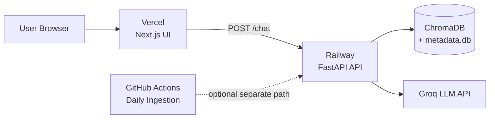

# Deployment Plan: Vercel (Frontend) + Railway (Backend)

This guide deploys the **Mutual Fund FAQ Assistant** with:

| Component | Platform | URL pattern |
|-----------|----------|-------------|
| **Frontend** (Next.js) | [Vercel](https://vercel.com) | `https://your-app.vercel.app` |
| **Backend** (FastAPI) | [Railway](https://railway.app) | `https://your-api.up.railway.app` |
| **Daily ingestion** | GitHub Actions (recommended) | `.github/workflows/daily-ingestion.yml` |

---

## Architecture



The UI calls the Railway API using `NEXT_PUBLIC_API_URL`. The API loads BGE embedding models and ChromaDB from the `data/` directory at startup.

---

## Prerequisites

Before deploying, ensure you have:

- A [GitHub](https://github.com) repo with this project pushed (e.g. `rag-demo-1`)
- A [Groq API key](https://console.groq.com) for LLM generation
- A [Vercel](https://vercel.com) account (GitHub login)
- A [Railway](https://railway.app) account (GitHub login)

**Recommended Railway plan:** at least **2 GB RAM** — the API loads two BGE embedding models (`bge-small` + `bge-large`) on startup.

---

## Part 1: Deploy Backend on Railway

### 1.1 Create the Railway project

1. Go to [railway.app](https://railway.app) → **New Project** → **Deploy from GitHub repo**.
2. Select your repository (e.g. `aayush13022/rag-demo-1`).
3. Railway auto-detects Python. Confirm the **root directory** is the repo root (not `ui/`).

### 1.2 Configure the start command

The repo includes a `railway.toml` and a `Procfile`, so Railway uses this start
command automatically:

```bash
uvicorn api.main:app --host 0.0.0.0 --port $PORT
```

Railway injects `$PORT` automatically. Do not hardcode `8000`. To override, set
**Settings → Deploy → Start Command** to the same value.

### 1.3 Set environment variables

In **Variables**, add:

| Variable | Value | Required |
|----------|-------|----------|
| `GROQ_API_KEY` | Your Groq API key | Yes |
| `LLM_PROVIDER` | `groq` | Yes |
| `LLM_MODEL` | `llama-3.1-8b-instant` (faster) or `llama-3.3-70b-versatile` | Yes |
| `EMBEDDING_PROVIDER` | `bge` | Yes |
| `EMBEDDING_MODEL_SMALL` | `BAAI/bge-small-en-v1.5` | Yes |
| `EMBEDDING_MODEL_LARGE` | `BAAI/bge-large-en-v1.5` | Yes |
| `CHROMA_PERSIST_DIR` | `/data/chroma` | Yes (with volume) |
| `METADATA_DB_PATH` | `/data/metadata.db` | Yes (with volume) |
| `LOG_LEVEL` | `INFO` | Optional |
| `FETCH_TRUST_ENV` | `false` | Optional |
| `CORS_ORIGINS` | `https://your-app.vercel.app` | Yes (see 1.5) |
| `WARMUP_ON_STARTUP` | `false` | Yes on Railway (default auto-off) |
| `BGE_KEEP_SINGLE_MODEL` | `true` | Yes on Railway (default auto-on) |
| `TOKENIZERS_PARALLELISM` | `false` | Recommended |
| `OMP_NUM_THREADS` | `1` | Recommended |

> **Note:** Use `/data/...` paths when attaching a Railway Volume (step 1.4). If you skip the volume, use `./data/chroma` and `./data/metadata.db` — data will reset on every redeploy.

### 1.4 Attach a persistent volume (recommended)

The corpus (`data/chroma/`, `data/metadata.db`) must survive redeploys.

1. In your Railway service → **Volumes** → **Add Volume**.
2. Mount path: `/data`
3. Set `CHROMA_PERSIST_DIR=/data/chroma` and `METADATA_DB_PATH=/data/metadata.db`.
4. On first deploy, copy bundled demo data into the volume (one-time):

```bash
# Run via Railway shell or a one-off deploy command
mkdir -p /data/chroma && cp -r data/chroma/* /data/chroma/ 2>/dev/null || true
cp data/metadata.db /data/metadata.db 2>/dev/null || true
```

Alternatively, trigger ingestion after deploy:

```bash
python -m scheduler --once
```

### 1.5 Allow your Vercel domain via CORS

`api/main.py` already supports a `CORS_ORIGINS` environment variable. Localhost
origins are always allowed; any comma-separated values in `CORS_ORIGINS` are
appended (trailing slashes are stripped and duplicates removed):

```python
DEFAULT_ALLOWED_ORIGINS = [
    "http://localhost:3000",
    "http://127.0.0.1:3000",
]


def _allowed_origins() -> list[str]:
    origins = list(DEFAULT_ALLOWED_ORIGINS)
    extra = os.getenv("CORS_ORIGINS", "")
    for origin in extra.split(","):
        cleaned = origin.strip().rstrip("/")
        if cleaned and cleaned not in origins:
            origins.append(cleaned)
    return origins
```

Just set the variable on Railway — **no code change needed**:

```
CORS_ORIGINS=https://your-app.vercel.app
```

For multiple domains (e.g. a custom domain), use a comma-separated list:

```
CORS_ORIGINS=https://your-app.vercel.app,https://faq.yourdomain.com
```

> Note: CORS matches exact origins; wildcard patterns like `https://your-app-*.vercel.app`
> are not supported. Add each preview/custom domain explicitly.

### 1.6 Generate a public domain

1. Railway service → **Settings → Networking** → **Generate Domain**.
2. Copy the URL, e.g. `https://rag-demo-1-production.up.railway.app`.
3. Verify:

```bash
curl https://your-api.up.railway.app/health
# Expected: {"status":"ok"}
```

**First startup** may take 2–5 minutes while BGE models download and warm up.

---

## Part 2: Deploy Frontend on Vercel

### 2.1 Import the project

1. Go to [vercel.com](https://vercel.com) → **Add New → Project**.
2. Import the same GitHub repository.
3. Configure the project:

| Setting | Value |
|---------|-------|
| **Framework Preset** | Next.js |
| **Root Directory** | `ui` |
| **Build Command** | `npm run build` (default) |
| **Output Directory** | **leave empty** (do not set `public`) |
| **Install Command** | `npm install` (default) |

> `ui/vercel.json` is included so Vercel detects this as a Next.js app.
> If you see *"No Output Directory named public found"*, clear **Output Directory**
> in Vercel → Project Settings → Build & Development Settings.

### 2.2 Set environment variables

In **Settings → Environment Variables**, add **both**:

| Variable | Value | Environments |
|----------|-------|--------------|
| `NEXT_PUBLIC_API_URL` | `https://your-api.up.railway.app` | Production, Preview, Development |
| `API_URL` | `https://your-api.up.railway.app` | Production, Preview, Development |

Use your Railway public URL — **no trailing slash**.

`NEXT_PUBLIC_API_URL` lets the browser call Railway directly (avoids Vercel proxy
timeouts on the first slow request). `API_URL` powers the `/api` fallback proxy.

**Important:** `NEXT_PUBLIC_*` variables are baked in at build time — you must
**redeploy** after adding or changing them.

### 2.3 Deploy

Click **Deploy**. Vercel builds the Next.js app from the `ui/` folder.

After deploy, open `https://your-app.vercel.app` and test a question like:

> What is the expense ratio of HDFC Defence Fund Direct Growth?

---

## Part 3: Connect Frontend and Backend

### Checklist

- [ ] Railway `/health` returns `{"status":"ok"}`
- [ ] `NEXT_PUBLIC_API_URL` on Vercel points to Railway URL
- [ ] `CORS_ORIGINS` on Railway includes your Vercel domain
- [ ] `GROQ_API_KEY` is set on Railway
- [ ] Corpus data exists (`/corpus/status` shows `active_version`)

### Verify corpus status

```bash
curl https://your-api.up.railway.app/corpus/status
```

Expected fields: `active_version`, `last_updated_from_sources`, `sources` (5 funds).

### Verify chat from browser

Open DevTools → Network. A chat message should `POST` to:

```
https://your-api.up.railway.app/chat
```

If you see a CORS error, recheck `CORS_ORIGINS` on Railway and redeploy the API.

---

## Part 4: Daily Ingestion in Production

The chatbot needs fresh corpus data. Choose one approach:

### Option A: GitHub Actions (recommended — already configured)

The repo includes `.github/workflows/daily-ingestion.yml` which runs at **10:00 AM IST** daily.

**Limitation:** GitHub Actions updates data in the CI runner, **not** on Railway. Use this for CI validation only, or add a step to push updated `data/` to Railway (advanced).

### Option B: Railway Cron service (production data refresh)

1. Add a **second Railway service** from the same repo.
2. Start command:

```bash
python -m scheduler --once
```

3. In Railway → **Cron Schedule**: `30 4 * * *` (10:00 AM IST = 04:30 UTC).
4. Share the same `/data` volume with the API service so ingestion updates the live index.

### Option C: Manual refresh

```bash
# Railway shell on the API service
python -m scheduler --once
```

---

## Part 5: Environment Variable Reference

### Railway (backend)

```env
GROQ_API_KEY=gsk_...
LLM_PROVIDER=groq
LLM_MODEL=llama-3.1-8b-instant
EMBEDDING_PROVIDER=bge
EMBEDDING_MODEL_SMALL=BAAI/bge-small-en-v1.5
EMBEDDING_MODEL_LARGE=BAAI/bge-large-en-v1.5
CHROMA_PERSIST_DIR=/data/chroma
METADATA_DB_PATH=/data/metadata.db
CORS_ORIGINS=https://your-app.vercel.app
WARMUP_ON_STARTUP=false
BGE_KEEP_SINGLE_MODEL=true
TOKENIZERS_PARALLELISM=false
OMP_NUM_THREADS=1
LOG_LEVEL=INFO
FETCH_TRUST_ENV=false
```

### Vercel (frontend)

```env
NEXT_PUBLIC_API_URL=https://your-api.up.railway.app
API_URL=https://your-api.up.railway.app
```

---

## Part 6: Post-Deployment Verification

| Test | Command / action | Expected |
|------|------------------|----------|
| API health | `curl .../health` | `{"status":"ok"}` |
| Corpus loaded | `curl .../corpus/status` | `active_version: v3`, 5 sources |
| Chat works | Ask a factual question in UI | Answer + source link |
| Advisory refused | "Should I invest in HDFC Defence?" | Refusal + AMFI link |
| Out-of-context | "What is the weather?" | "I could not find this information..." |

---

## Troubleshooting

### CORS error in browser

- Add your exact Vercel URL to `CORS_ORIGINS` on Railway.
- Redeploy the Railway service after changing `api/main.py`.
- Check for `http` vs `https` mismatch.

### 503 / "Assistant temporarily unavailable"

- Verify `GROQ_API_KEY` is set on Railway.
- Check Railway logs for embedding or LLM errors.
- Ensure corpus exists (`/corpus/status`).

### Slow first request

- Normal: BGE models load on first request (~1–3 min on first deploy).
- Warmup runs in a **background thread**, so `/health` responds immediately while
  models load. Wait for logs to show `BGE embedding models warmed up`.

### Restart loop on startup (logs repeat "Started server process" / reload models)

This means Railway is killing the container during startup — usually **out of
memory** from loading both BGE models, or the startup exceeds the health-check
timeout. Fixes:

- Warmup is already **non-blocking** (background thread) and **non-fatal**, so the
  app boots and serves `/health` even if model loading is slow or fails.
- On very low-memory instances, set `WARMUP_ON_STARTUP=false` to load models
  lazily on the first request instead of at boot.
- Upgrade to a plan with **≥ 2 GB RAM** (recommended for local BGE models).
- Or switch to `EMBEDDING_PROVIDER=openai` (requires `OPENAI_API_KEY`) to avoid
  loading BGE locally and drastically reduce memory use.
- Set the health-check path to `/health` with a generous timeout in Railway.

### Chat returns empty / no retrieval

- Corpus may be missing on the volume. Run `python -m scheduler --once` on Railway.
- Confirm `CHROMA_PERSIST_DIR` and `METADATA_DB_PATH` point to the mounted volume.

### Railway out of memory

- Upgrade to a plan with **≥ 2 GB RAM**.
- Set `WARMUP_ON_STARTUP=false` so both models don't load at boot.
- Or switch to `EMBEDDING_PROVIDER=openai` (requires `OPENAI_API_KEY`) to avoid loading BGE locally.

### Vercel build fails

- Confirm **Root Directory** is `ui`, not the repo root.
- Run `cd ui && npm run build` locally to catch errors first.

---

## Deployment Order Summary

```text
1. Push code to GitHub
2. Deploy backend on Railway
   ├── Set env vars + start command
   ├── Attach /data volume
   ├── Update CORS (api/main.py + CORS_ORIGINS)
   └── Verify /health and /corpus/status
3. Deploy frontend on Vercel
   ├── Root directory: ui
   └── NEXT_PUBLIC_API_URL → Railway URL
4. Test end-to-end chat on Vercel URL
5. Set up daily ingestion (Railway cron or manual)
```

---

## Related docs

- [scheduler.md](./scheduler.md) — daily ingestion worker
- [implementation-plan.md](./implementation-plan.md) — Phase 7 scheduler details
- [architecture.md](./architecture.md) — system design
