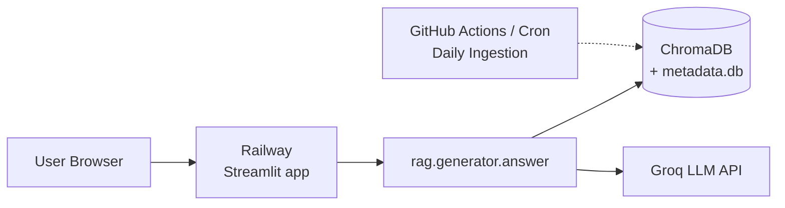

# Deployment Plan: Streamlit on Railway

The **Mutual Fund FAQ Assistant** now runs as a **single Streamlit app** — the UI and
the RAG backend live in one Python process. No separate Next.js frontend or FastAPI
backend is required.

| Component | Platform | URL pattern |
|-----------|----------|-------------|
| **Streamlit app** (UI + RAG) | [Railway](https://railway.app) | `https://your-app.up.railway.app` |
| **Daily ingestion** | GitHub Actions / Railway cron | `.github/workflows/daily-ingestion.yml` |

> **Legacy stack:** The old Next.js (`ui/`) + FastAPI (`api/`) deployment is kept in
> the repo for reference but is no longer the default deploy path. See
> [Appendix: Legacy Vercel + FastAPI](#appendix-legacy-vercel--fastapi) if you need it.

---

## Architecture



The browser talks **only** to the Streamlit app (same origin — no CORS, no API proxy).
Streamlit calls the RAG pipeline in-process:

```text
streamlit_app.py → stapp/chat_handler.py (guardrails) → rag/generator.py (retrieve + LLM)
```

---

## Prerequisites

- A [GitHub](https://github.com) repo with this project pushed (e.g. `rag-demo-1`)
- A [Groq API key](https://console.groq.com) for LLM generation
- A [Railway](https://railway.app) account (GitHub login)

**Recommended Railway plan:** at least **2 GB RAM** — the app loads BGE embedding
models on first request.

---

## Run locally first

```bash
# From repo root
pip install -r requirements.txt
cp .env.example .env        # add your GROQ_API_KEY
streamlit run streamlit_app.py
```

Open [http://localhost:8501](http://localhost:8501) and test:

> What is the expense ratio of HDFC Defence Fund Direct Growth?

If the corpus is missing, build it once:

```bash
python -m scheduler --once
```

---

## Deploy on Railway

### 1. Create the project

1. Go to [railway.app](https://railway.app) → **New Project** → **Deploy from GitHub repo**.
2. Select your repository (e.g. `aayush13022/rag-demo-1`).
3. Railway auto-detects Python. Keep the **root directory** as the repo root.

### 2. Start command

The repo includes a `Procfile` and `railway.toml`, so Railway starts Streamlit
automatically:

```bash
streamlit run streamlit_app.py --server.port=$PORT --server.address=0.0.0.0
```

Railway injects `$PORT`. Health-check path is `/_stcore/health` (Streamlit's
built-in health endpoint).

To override manually: **Settings → Deploy → Start Command** = the line above.

### 3. Set environment variables

In **Variables**, add:

| Variable | Value | Required |
|----------|-------|----------|
| `GROQ_API_KEY` | Your Groq API key | Yes |
| `LLM_PROVIDER` | `groq` | Yes |
| `LLM_MODEL` | `llama-3.1-8b-instant` (faster) or `llama-3.3-70b-versatile` | Yes |
| `EMBEDDING_PROVIDER` | `bge` | Yes |
| `EMBEDDING_MODEL_SMALL` | `BAAI/bge-small-en-v1.5` | Yes |
| `EMBEDDING_MODEL_LARGE` | `BAAI/bge-large-en-v1.5` | Yes |
| `CHROMA_PERSIST_DIR` | `/data/chroma` | Yes (with volume) |
| `METADATA_DB_PATH` | `/data/metadata.db` | Yes (with volume) |
| `BGE_KEEP_SINGLE_MODEL` | `true` | Recommended (lower memory) |
| `TOKENIZERS_PARALLELISM` | `false` | Recommended |
| `OMP_NUM_THREADS` | `1` | Recommended |
| `LOG_LEVEL` | `INFO` | Optional |
| `FETCH_TRUST_ENV` | `false` | Optional |

> **No `CORS_ORIGINS` or `API_URL` needed** — there is only one origin now.
>
> **Note:** Use `/data/...` paths when attaching a Railway Volume (step 4). Without a
> volume, use `./data/chroma` and `./data/metadata.db` — but data resets on every redeploy.

### 4. Attach a persistent volume (recommended)

The corpus (`data/chroma/`, `data/metadata.db`) must survive redeploys.

1. Railway service → **Volumes** → **Add Volume**.
2. Mount path: `/data`
3. Set `CHROMA_PERSIST_DIR=/data/chroma` and `METADATA_DB_PATH=/data/metadata.db`.
4. On first deploy, copy bundled demo data into the volume (one-time, via Railway shell):

```bash
mkdir -p /data/chroma && cp -r data/chroma/* /data/chroma/ 2>/dev/null || true
cp data/metadata.db /data/metadata.db 2>/dev/null || true
```

Or build the corpus fresh after deploy:

```bash
python -m scheduler --once
```

### 5. Generate a public domain

1. Railway service → **Settings → Networking** → **Generate Domain**.
2. Copy the URL, e.g. `https://rag-demo-1-production.up.railway.app`.
3. Open it in a browser. **First load** may take 2–5 minutes while BGE models download.

---

## Daily Ingestion in Production

The chatbot needs fresh corpus data. Choose one approach:

### Option A: GitHub Actions (already configured)

`.github/workflows/daily-ingestion.yml` runs at **10:00 AM IST** daily.

**Limitation:** GitHub Actions updates data in the CI runner, **not** on Railway. Use
this for CI validation, or add a step to sync `data/` to the Railway volume (advanced).

### Option B: Railway Cron service (production refresh)

1. Add a **second Railway service** from the same repo.
2. Start command: `python -m scheduler --once`
3. **Cron Schedule**: `30 4 * * *` (10:00 AM IST = 04:30 UTC).
4. Share the same `/data` volume with the Streamlit service so ingestion updates the live index.

### Option C: Manual refresh

```bash
# Railway shell on the Streamlit service
python -m scheduler --once
```

---

## Environment Variable Reference

```env
GROQ_API_KEY=gsk_...
LLM_PROVIDER=groq
LLM_MODEL=llama-3.1-8b-instant
EMBEDDING_PROVIDER=bge
EMBEDDING_MODEL_SMALL=BAAI/bge-small-en-v1.5
EMBEDDING_MODEL_LARGE=BAAI/bge-large-en-v1.5
CHROMA_PERSIST_DIR=/data/chroma
METADATA_DB_PATH=/data/metadata.db
BGE_KEEP_SINGLE_MODEL=true
TOKENIZERS_PARALLELISM=false
OMP_NUM_THREADS=1
LOG_LEVEL=INFO
FETCH_TRUST_ENV=false
```

---

## Post-Deployment Verification

| Test | Action | Expected |
|------|--------|----------|
| App health | Open `https://your-app.up.railway.app/_stcore/health` | `ok` |
| App loads | Open the app URL | Disclaimer + welcome + 5 schemes |
| Chat works | Ask a factual question | Answer + Groww source link |
| Advisory refused | "Should I invest in HDFC Defence?" | Refusal + AMFI link |
| Out-of-context | "What is the weather?" | "I could not find this information..." |

---

## Troubleshooting

### App won't start / health check fails

- Confirm the start command targets `streamlit_app.py` (not `api.main:app`).
- Health-check path must be `/_stcore/health`.
- Check Railway logs for missing `GROQ_API_KEY` or import errors.

### Slow first request

- Normal: BGE models load on first request (~1–3 min on a fresh deploy).
- Streamlit caches the warmed stack via `@st.cache_resource`, so later requests are fast.

### Chat returns "temporarily unavailable"

- Verify `GROQ_API_KEY` is set.
- Check Railway logs for embedding or LLM errors.
- Ensure corpus exists (run `python -m scheduler --once`).

### Chat returns empty / no retrieval

- Corpus may be missing on the volume. Run `python -m scheduler --once` on Railway.
- Confirm `CHROMA_PERSIST_DIR` and `METADATA_DB_PATH` point to the mounted volume.

### Railway out of memory

- Upgrade to a plan with **≥ 2 GB RAM**.
- Keep `BGE_KEEP_SINGLE_MODEL=true` so only one BGE model loads at a time.
- Or switch to `EMBEDDING_PROVIDER=openai` (requires `OPENAI_API_KEY`) to avoid loading BGE locally.

---

## Deployment Order Summary

```text
1. Push code to GitHub
2. Run locally to confirm corpus + chat work
3. Deploy on Railway
   ├── Set env vars (GROQ_API_KEY, Chroma paths, BGE flags)
   ├── Attach /data volume + seed corpus
   ├── Generate public domain
   └── Verify /_stcore/health and a chat question
4. Set up daily ingestion (Railway cron or manual)
```

---

## Appendix: Legacy Vercel + FastAPI

The repo still contains the original split stack:

- **Frontend:** Next.js under `ui/` (deploy to Vercel, root directory `ui`, env `API_URL`).
- **Backend:** FastAPI `api/main.py` (deploy to Railway, start `uvicorn api.main:app --host 0.0.0.0 --port $PORT`).
- The Vercel UI proxies browser requests through `ui/app/api/[...path]/route.ts` to the
  FastAPI `POST /chat`, using the `API_URL` env var (set `CORS_ORIGINS` on the API).

This path is optional. The Streamlit app above is the recommended single-service deploy.

---

## Related docs

- [streamlit.md](./streamlit.md) — Streamlit app run & deploy details
- [scheduler.md](./scheduler.md) — daily ingestion worker
- [implementation-plan.md](./implementation-plan.md) — Phase 7 scheduler details
- [architecture.md](./architecture.md) — system design
