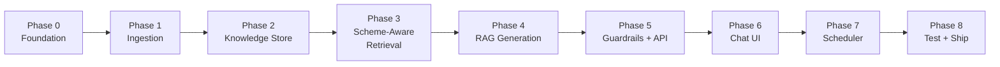
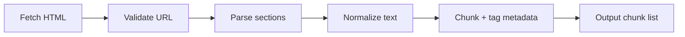
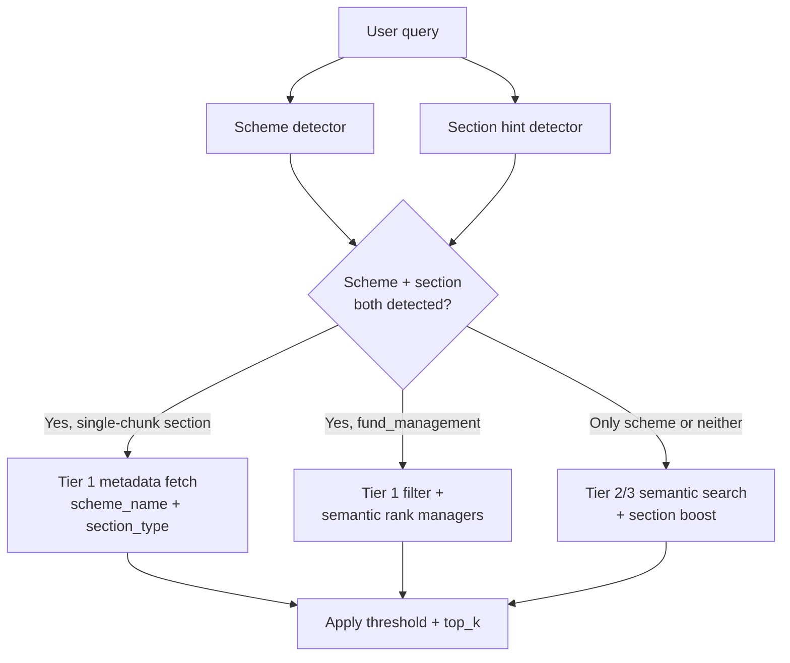
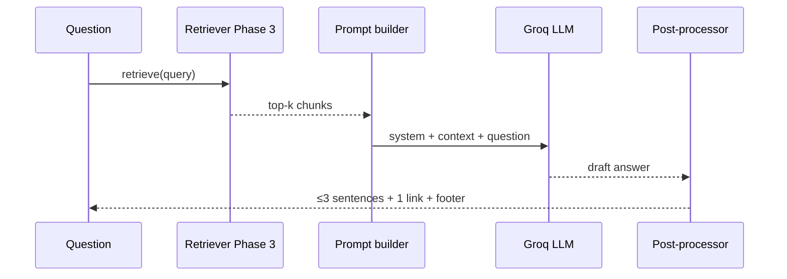
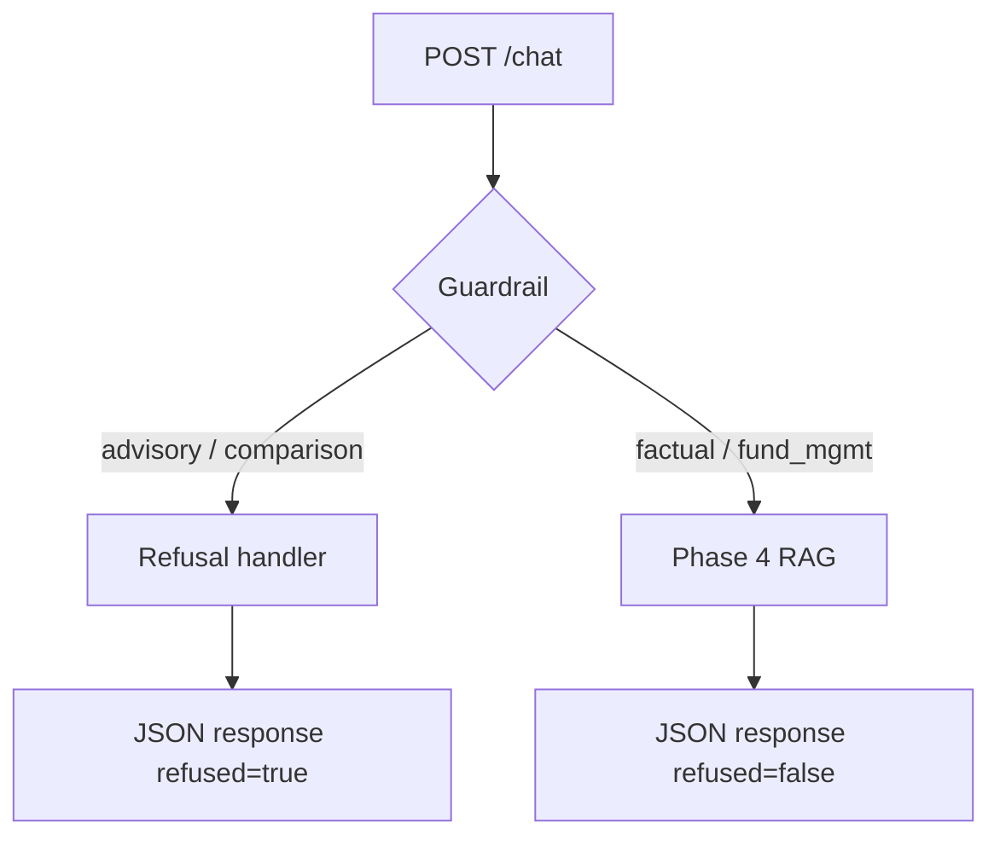
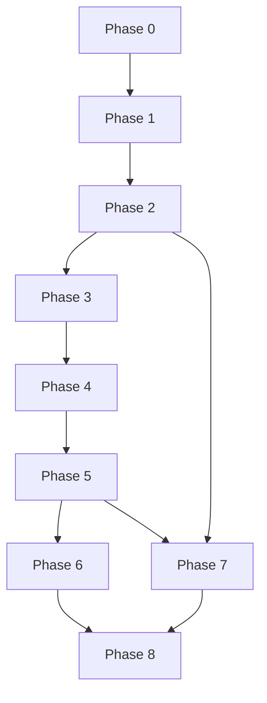

# Phase-Wise Implementation Plan (Detailed)

This document is the **complete build guide** for the Mutual Fund FAQ Assistant. It translates [problemStatement.md](./problemStatement.md) and [architecture.md](./architecture.md) into actionable phases with tasks, file-level guidance, config examples, tests, and checklists.

---

## How to Read This Document

Each phase includes:

| Section | Purpose |
|---------|---------|
| **Simple summary** | Quick takeaway — what you build and why |
| **Goal & scope** | Detailed objective and boundaries |
| **Tasks** | `### Tasks` — numbered work items with implementation notes (present in every phase) |
| **Files to create** | Exact paths |
| **Config / code examples** | Copy-paste starting points |
| **Tests** | How to verify the phase works |
| **Exit criteria** | Must-pass before moving on |
| **Phase checklist** | Checkbox list to mark completion |

### Phase Task Index

Every phase (0–8) includes a `### Tasks` section. Architecture-aligned task summaries live in [architecture.md §19](./architecture.md#19-implementation-phases).

| Phase | Name | Tasks in this doc | Architecture tasks |
|-------|------|-------------------|-------------------|
| **0** | Foundation & Setup | [Tasks](#phase-0-foundation--project-setup) | [§19.1](./architecture.md#191-phase-0-foundation--project-setup) |
| **1** | Ingestion Pipeline | [Tasks](#phase-1-ingestion-pipeline) | [§19.2](./architecture.md#192-phase-1-ingestion-pipeline) |
| **2** | Knowledge Store & Embeddings | [Tasks](#phase-2-knowledge-store--embeddings) | [§19.3](./architecture.md#193-phase-2-knowledge-store--embeddings) |
| **3** | Scheme-Aware Retrieval | [Tasks](#phase-3-scheme-aware-retrieval-with-section-boosting) | [§19.4](./architecture.md#194-phase-3-scheme-aware-retrieval-with-section-boosting) |
| **4** | RAG Generation | [Tasks](#phase-4-rag-query-service-generation) | [§19.5](./architecture.md#195-phase-4-rag-query-service-generation) |
| **5** | Guardrails + API | [Tasks](#phase-5-guardrails-refusal--api-layer) | [§19.6](./architecture.md#196-phase-5-guardrails-refusal--api-layer) |
| **6** | Chat UI | [Tasks](#phase-6-chat-ui) | [§19.7](./architecture.md#197-phase-6-chat-ui) |
| **7** | Scheduler | [Tasks](#phase-7-scheduler--observability) | [§19.8](./architecture.md#198-phase-7-scheduler--observability) |
| **8** | Test + Ship | [Tasks](#phase-8-testing-documentation--release) | [§19.9](./architecture.md#199-phase-8-testing-documentation--release) |

---

## Project Overview

### Simple Summary

You are building a **facts-only chatbot** that answers questions about **5 HDFC mutual funds** using data from Groww pages. It uses RAG (retrieve relevant text → generate short answer), refuses investment advice, cites one source per answer, and refreshes data daily via a scheduler.

### Project Facts

| Item | Detail |
|------|--------|
| **Goal** | Facts-only RAG chatbot for 5 HDFC schemes on Groww |
| **AMC** | HDFC Mutual Fund |
| **Corpus** | 5 allowlisted Groww fund pages |
| **Core stack** | Python 3.11+, Streamlit (UI + RAG), ChromaDB, SQLite, APScheduler, BGE embeddings (local) + Groq LLM (legacy: FastAPI + Next.js) |
| **Total phases** | 8 (Phase 0 → Phase 8) |
| **Estimated duration** | 4–6 weeks (solo developer, MVP) |
| **Hard rules** | ≤3 sentences, exactly 1 source link, no investment advice, no PII |

### Allowlisted Corpus (5 URLs)

| # | Scheme | URL |
|---|--------|-----|
| 1 | HDFC Mid Cap Fund Direct Growth | https://groww.in/mutual-funds/hdfc-mid-cap-fund-direct-growth |
| 2 | HDFC Large Cap Fund Direct Growth | https://groww.in/mutual-funds/hdfc-large-cap-fund-direct-growth |
| 3 | HDFC Small Cap Fund Direct Growth | https://groww.in/mutual-funds/hdfc-small-cap-fund-direct-growth |
| 4 | HDFC Gold ETF Fund of Fund Direct Plan Growth | https://groww.in/mutual-funds/hdfc-gold-etf-fund-of-fund-direct-plan-growth |
| 5 | HDFC Defence Fund Direct Growth | https://groww.in/mutual-funds/hdfc-defence-fund-direct-growth |

### Phase Map



### Build Order Rationale

| Step | Phase | Why this order |
|------|-------|----------------|
| 1 | 0 | Config and skeleton first — everything depends on it |
| 2 | 1 | No RAG without parsed documents |
| 3 | 2 | Chunks must be embedded and stored before search |
| 4 | 3 | Smart retrieval before LLM — garbage in = garbage out |
| 5 | 4 | Generation only after retrieval works |
| 6 | 5 | Guardrails + API before exposing to users |
| 7 | 6 | UI wires to API |
| 8 | 7 | Automate daily refresh |
| 9 | 8 | End-to-end validation and docs |

### Target Directory Structure

```
rag-project/
├── config/
│   └── corpus.yaml
├── docs/
│   ├── problemStatement.md
│   ├── architecture.md
│   └── implementation-plan.md
├── ingestion/
│   ├── fetcher.py
│   ├── parser.py
│   ├── normalizer.py
│   ├── chunker.py
│   ├── embedder.py
│   ├── pipeline.py
│   └── scheduler.py
├── rag/
│   ├── scheme_detector.py    # Phase 3
│   ├── section_detector.py   # Phase 3
│   ├── retriever.py          # Phase 3
│   ├── prompts.py            # Phase 4
│   ├── llm.py                # Phase 4 (Groq + mock)
│   ├── postprocessor.py      # Phase 4
│   ├── generator.py          # Phase 4
│   └── guardrails.py         # Phase 5
├── api/
│   ├── main.py
│   └── routes/
│       ├── chat.py
│       └── corpus.py
├── storage/
│   ├── vector_store.py
│   └── metadata_store.py
├── ui/
├── scripts/
│   ├── ingest.py
│   ├── test_retrieval.py     # Phase 3
│   └── evaluate.py           # Phase 8
├── data/
│   ├── raw/
│   ├── chroma/
│   └── metadata.db
├── tests/
├── .env.example
├── requirements.txt
└── README.md
```

---

## Phase 0: Foundation & Project Setup

**Duration:** 2–3 days

### Simple Summary

Set up the project folder, install dependencies, create config files for the 5 fund URLs, and verify a bare FastAPI app runs. No chatbot logic yet — just the foundation.

### Goal & Scope

Create a runnable skeleton where:
- All 5 corpus URLs are configured in one place
- Environment variables are documented
- An empty API starts without errors
- Logging is ready for ingestion and query paths

**Out of scope:** Ingestion, RAG, UI.

**Architecture tasks:** [architecture.md §19.1](./architecture.md#191-phase-0-foundation--project-setup)

### Tasks

| # | Task | Implementation notes |
|---|------|-------------------|
| 0.1 | Initialize repo structure | Create all folders from target structure above; add `__init__.py` in Python packages |
| 0.2 | Python environment | `python3.11 -m venv .venv && source .venv/bin/activate` |
| 0.3 | Dependencies | Pin versions in `requirements.txt` for reproducibility |
| 0.4 | `config/corpus.yaml` | Single source of truth for URLs, chunking, retrieval, scheduler |
| 0.5 | `.env.example` | Never commit real API keys |
| 0.6 | Config loader | `config/settings.py` — load YAML + env; validate 5 URLs present |
| 0.7 | Logging | Use `logging` module; JSON or structured format; log level from env |

### Files to Create

- `config/corpus.yaml`
- `config/settings.py`
- `api/main.py` (minimal health route)
- `.env.example`
- `requirements.txt`
- `.gitignore` (include `.env`, `data/`, `__pycache__`)

### `requirements.txt` (starter)

```
fastapi>=0.110.0
uvicorn>=0.27.0
httpx>=0.27.0
beautifulsoup4>=4.12.0
chromadb>=0.4.0
apscheduler>=3.10.0
pyyaml>=6.0.0
python-dotenv>=1.0.0
openai>=1.30.0
tiktoken>=0.6.0
sentence-transformers>=3.0.0
```

### `.env.example`

```env
OPENAI_API_KEY=sk-...
EMBEDDING_PROVIDER=bge
EMBEDDING_MODEL_SMALL=BAAI/bge-small-en-v1.5
EMBEDDING_MODEL_LARGE=BAAI/bge-large-en-v1.5
EMBEDDING_MODEL=text-embedding-3-small
LLM_PROVIDER=groq
GROQ_API_KEY=gsk_...
LLM_MODEL=llama-3.3-70b-versatile
LLM_TEMPERATURE=0
CHROMA_PERSIST_DIR=./data/chroma
METADATA_DB_PATH=./data/metadata.db
LOG_LEVEL=INFO
API_HOST=0.0.0.0
API_PORT=8000
```

`EMBEDDING_PROVIDER` values: `bge` (default, local) or `openai` (cloud, single model).

### `config/corpus.yaml` (starter)

```yaml
amc: HDFC Mutual Fund

sources:
  - scheme_name: HDFC Mid Cap Fund Direct Growth
    url: https://groww.in/mutual-funds/hdfc-mid-cap-fund-direct-growth
    aliases: [mid cap, hdfc mid cap]
  - scheme_name: HDFC Large Cap Fund Direct Growth
    url: https://groww.in/mutual-funds/hdfc-large-cap-fund-direct-growth
    aliases: [large cap, hdfc large cap]
  - scheme_name: HDFC Small Cap Fund Direct Growth
    url: https://groww.in/mutual-funds/hdfc-small-cap-fund-direct-growth
    aliases: [small cap, hdfc small cap]
  - scheme_name: HDFC Gold ETF Fund of Fund Direct Plan Growth
    url: https://groww.in/mutual-funds/hdfc-gold-etf-fund-of-fund-direct-plan-growth
    aliases: [gold etf, gold fund of fund]
  - scheme_name: HDFC Defence Fund Direct Growth
    url: https://groww.in/mutual-funds/hdfc-defence-fund-direct-growth
    aliases: [defence, defense, hdfc defence]

chunking:
  strategy: section_first
  chunk_size_tokens: 600
  chunk_overlap_tokens: 0
  fund_management_split: per_manager
  strip_other_schemes_list: true

embeddings:
  provider: bge
  model_small: BAAI/bge-small-en-v1.5
  model_large: BAAI/bge-large-en-v1.5
  token_threshold: 80
  section_model_map:
    expense_ratio: small
    benchmark: small
    minimum_investment: small
    exit_load: small
    overview: large
    tax: large
    investment_objective: large
    fund_house: large
    fund_management: large
  batch_size: 32
  cache_by_text_hash: true

retrieval:
  top_k: 5
  candidate_k: 10
  similarity_threshold: 0.7
  section_boost:
    fund_management: 0.15
    expense_ratio: 0.15
    exit_load: 0.15
    minimum_investment: 0.15
    benchmark: 0.15
    tax: 0.15
    investment_objective: 0.15
    overview: 0.10
    fund_house: 0.10

sections:
  - overview
  - expense_ratio
  - exit_load
  - minimum_investment
  - benchmark
  - tax
  - fund_management
  - investment_objective
  - fund_house

scheduler:
  enabled: true
  cron: "0 6 * * *"
  timezone: Asia/Kolkata
  max_retries: 3
  retry_backoff_seconds: 60
```

### Tests

```bash
# Load config
python -c "from config.settings import load_settings; s = load_settings(); print(len(s.sources))"
# Expected: 5

# Start API
uvicorn api.main:app --reload
curl http://localhost:8000/health
# Expected: {"status": "ok"}
```

### Exit Criteria

- [ ] Config loader returns all 5 sources
- [ ] FastAPI `/health` returns 200
- [ ] `.env.example` documents all required vars
- [ ] Project structure matches target layout

### Phase 0 Checklist

- [ ] 0.1 Repo structure created
- [ ] 0.2 Virtual environment working
- [ ] 0.3 Dependencies installed
- [ ] 0.4 `corpus.yaml` with 5 URLs + aliases
- [ ] 0.5 `.env.example` created
- [ ] 0.6 Config loader tested
- [ ] 0.7 Logging configured

---

## Phase 1: Ingestion Pipeline

**Duration:** 5–7 days

### Simple Summary

Fetch the 5 Groww fund pages, extract useful sections (expense ratio, exit load, fund managers, etc.), clean the text, and split into chunks with metadata tags. This is your raw knowledge — no AI yet.

### Goal & Scope

Transform 5 Groww HTML pages into structured, tagged text chunks ready for embedding.

**In scope:** Fetch, parse, normalize, chunk, CLI run, partial failure handling.  
**Out of scope:** Embeddings, retrieval, LLM.

Maps to [architecture.md §5](./architecture.md#5-ingestion-pipeline).  
**Architecture tasks:** [architecture.md §19.2](./architecture.md#192-phase-1-ingestion-pipeline)

### Ingestion Flow



### Tasks

| # | Task | Implementation notes |
|---|------|-------------------|
| 1.1 | `fetcher.py` | `httpx.AsyncClient` or sync; User-Agent header; 1–2s delay between URLs; timeout 30s; save to `data/raw/{scheme_slug}/{date}.html` |
| 1.2 | URL validator | Compare URL against `corpus.yaml`; raise error if not allowlisted |
| 1.3 | `parser.py` | **Section extraction** — tag content into 9 `section_type` values (see table below); locate by Groww headings; one section type per chunk |
| 1.4 | Fund management parser | Within `fund_management` section: manager name, tenure, education, experience, other schemes |
| 1.5 | `normalizer.py` | Remove nav, footer, scripts; collapse whitespace; output plain text; attach metadata dict per section |
| 1.6 | `chunker.py` | **Section-first** chunking: 1 chunk per section for 8 types; `fund_management` → 1 chunk per manager; 0 overlap; 600-token fallback only |
| 1.7 | `pipeline.py` | Loop 5 URLs; fetch → parse → normalize → chunk; collect per-URL status; return `IngestionResult` |
| 1.8 | CLI | `python scripts/ingest.py --dry-run` (parse + chunk) and `--full` (fetch + save) |
| 1.9 | Partial failures | If 1 URL fails: status `partial`; if all fail: `failed`; never crash silently |

### Section Extraction (Phase 1)

Tag every chunk with exactly one `section_type` from this list:

| `section_type` | Fields to extract | Groww page signals | Example question |
|----------------|-------------------|--------------------|------------------|
| `overview` | Scheme name, category, risk, NAV, AUM, riskometer | Fund header, key metrics | "What is the NAV of HDFC Defence?" |
| `expense_ratio` | Expense ratio (direct plan) | "Expense ratio" field | "What is the expense ratio?" |
| `exit_load` | Exit load rules, stamp duty on redemption | "Exit load" block | "What is the exit load?" |
| `minimum_investment` | Min SIP, min 1st/2nd investment | "Minimum investments" | "What is the minimum SIP?" |
| `benchmark` | Benchmark index name | "Fund benchmark" | "What is the benchmark?" |
| `tax` | Tax implications (LTCG, STCG) | "Tax implication" | "What are the tax implications?" |
| `fund_management` | Manager name, tenure, education, experience | "Fund management" block | "Who manages this fund?" |
| `investment_objective` | Investment objective statement | "Investment Objective" | "What is the investment objective?" |
| `fund_house` | AMC name, website, launch date | "Fund house" block | "When was the fund launched?" |

**Extraction rules:**

- Each section → separate normalized text block before chunking
- Do not merge `expense_ratio`, `exit_load`, and `tax` into one chunk
- `fund_management` must not be split across chunks mid-profile
- Log warning if expected section missing; fail URL only if zero sections extracted

### Chunking Strategy (Phase 1)

Based on cleaned `data/processed/*/clean.txt` output, the corpus is **small and highly structured** (~428–585 tokens per scheme across 9 sections). Use **section-first chunking**, not fixed-size sliding windows.

#### Principles

| # | Rule |
|---|------|
| C1 | **One `section_type` per chunk** — never merge sections |
| C2 | **Never combine** `expense_ratio`, `exit_load`, and `tax` |
| C3 | **Never split a manager profile** mid-block (name/tenure/education/experience stay together) |
| C4 | **Zero overlap** by default — sections are already atomic |
| C5 | Prepend context header to every chunk: `Scheme:` + `Section:` |

#### Per-section rules

| `section_type` | Strategy | Typical size |
|----------------|----------|--------------|
| `overview` | 1 chunk | ~40 tokens |
| `expense_ratio` | 1 chunk | ~8 tokens |
| `exit_load` | 1 chunk | ~37 tokens |
| `minimum_investment` | 1 chunk | ~25 tokens |
| `benchmark` | 1 chunk | ~12 tokens |
| `tax` | 1 chunk | ~42 tokens |
| `investment_objective` | 1 chunk | ~36 tokens |
| `fund_house` | 1 chunk | ~60 tokens |
| `fund_management` | **1 chunk per manager** | ~50–120 tokens each |

#### `fund_management` special handling

- Split on manager boundaries (`Manager 1:`, `Manager 2:`, …)
- Each chunk contains: name, tenure, education, experience
- **Strip** `Also manages these schemes` lists before embedding (retrieval noise)
- HDFC Defence → 3 chunks; other 4 schemes → 2 chunks each

#### Fallback (safety net only)

If a single section exceeds `chunk_size_tokens` (600), split on paragraph boundaries with `chunk_overlap_tokens` overlap **within that section only**. None of the current 5 schemes trigger this except potentially bloated future pages.

#### Expected chunk counts

| Scheme | Chunks |
|--------|--------|
| HDFC Defence | 11 (8 sections + 3 managers) |
| Other 4 schemes | 10 each (8 sections + 2 managers) |
| **Corpus total** | **~51 chunks** |

#### `chunk_id` format

```
{scheme_slug}-{section_type}-{sequence:03d}

Examples:
hdfc-defence-fund-direct-growth-expense_ratio-001
hdfc-defence-fund-direct-growth-fund_management-001
hdfc-defence-fund-direct-growth-fund_management-002
```

#### `config/corpus.yaml` chunking block

```yaml
chunking:
  strategy: section_first
  chunk_size_tokens: 600          # safety ceiling, not target
  chunk_overlap_tokens: 0         # 0 for this corpus
  fund_management_split: per_manager
  strip_other_schemes_list: true
```

#### Output artifacts

| Artifact | Path |
|----------|------|
| Raw HTML | `data/raw/{slug}/{date}.html` |
| Processed JSON | `data/processed/{slug}.json` |
| Clean text | `data/processed/{slug}/clean.txt` |
| Chunks JSON | `data/processed/{slug}/chunks.json` |

### Chunk Metadata Schema (output of Phase 1)

```python
@dataclass
class Chunk:
    chunk_id: str           # e.g. "hdfc-defence-fund-direct-growth-expense_ratio-001"
    text: str               # includes Scheme:/Section: header
    source_url: str
    scheme_name: str
    scheme_slug: str
    section_type: str
    ingested_at: datetime
    sequence: int = 1
    manager_name: str | None = None  # fund_management chunks only
```

### Files to Create

- `ingestion/fetcher.py`
- `ingestion/parser.py`
- `ingestion/normalizer.py`
- `ingestion/chunker.py`
- `ingestion/chunk_store.py`
- `ingestion/pipeline.py`
- `scripts/ingest.py`

### Tests

```bash
# Dry run — parse + chunk one URL (uses cache)
python scripts/ingest.py --url "https://groww.in/mutual-funds/hdfc-defence-fund-direct-growth" --dry-run --use-cache

# Full run — all 5 (fetch live or use --use-cache)
python scripts/ingest.py --full --use-cache

# Inspect chunks
python -c "
from ingestion.pipeline import run_ingestion
r = run_ingestion(use_cache=True)
print(r.documents_processed, r.chunks_written)
for c in r.chunks[:3]:
    print(c.chunk_id, c.section_type, c.text[:80])
"
```

### Exit Criteria

| Test | Expected |
|------|----------|
| Manual ingestion | ≥ 10 chunks per scheme (~51 total across 5 schemes) |
| HDFC Defence | 11 chunks (8 sections + 3 managers) |
| HDFC Defence | `expense_ratio` chunk contains expense ratio value |
| HDFC Defence | `exit_load` chunk contains exit load rule |
| HDFC Defence | `minimum_investment` chunk contains min SIP |
| HDFC Defence | `fund_management` chunks each contain one manager name + tenure |
| HDFC Defence | All 9 section types present (or logged warning for missing) |
| Invalid URL | Rejected with clear error |
| 1 of 5 URLs fails | Job status = `partial` |

### Common Pitfalls

| Pitfall | Fix |
|---------|-----|
| Groww page is JS-rendered | Try `httpx` first; fall back to Playwright only if needed |
| Duplicate nav text in chunks | Aggressive normalizer stripping |
| Fund manager block split across chunks | Section-first + per-manager split for `fund_management` |
| Long "Also manages" lists pollute retrieval | Strip before chunking (`strip_other_schemes_list: true`) |

### Phase 1 Checklist

- [x] 1.1 Fetcher saves raw HTML
- [x] 1.2 URL validator blocks non-allowlisted URLs
- [x] 1.3 Parser extracts all **9** section types
- [x] 1.4 Fund management data parsed for all 5 schemes
- [x] 1.5 Normalizer produces clean text
- [x] 1.6 Chunker applies section-first strategy (~51 chunks)
- [x] 1.7 Pipeline orchestrates end-to-end
- [x] 1.8 CLI works (`scripts/ingest.py`)
- [x] 1.9 Partial failure handling tested

---

## Phase 2: Knowledge Store & Embeddings

**Duration:** 3–4 days

### Simple Summary

Take the Phase 1 chunks (~51 total), embed them with **BGE-small** or **BGE-large** depending on chunk type and size, and store vectors in ChromaDB. Also track ingestion history in SQLite. Basic similarity search works — scheme-aware retrieval comes in Phase 3.

### Goal & Scope

Persist embedded chunks with metadata; support atomic index replacement on re-ingestion. Use **chunk-aware embedding model routing** so short factual chunks use BGE-small and longer semantic chunks use BGE-large.

**In scope:** Embedder (BGE + optional OpenAI), ChromaDB dual-index storage, SQLite metadata, pipeline integration, basic similarity search.  
**Out of scope:** Scheme-aware retrieval, section boosting, LLM.

Maps to [architecture.md §6.1–6.3](./architecture.md#61-vector-store).  
**Architecture tasks:** [architecture.md §19.3](./architecture.md#193-phase-2-knowledge-store--embeddings)

### Embedding Models (Phase 2)

Phase 2 supports **local BGE models** (default) with optional **OpenAI** fallback. The embedder picks the model **per chunk** based on `section_type` and token count.

#### Supported models

| Key | Model ID | Dims | Runs | Best for |
|-----|----------|------|------|----------|
| **small** | `BAAI/bge-small-en-v1.5` | 384 | Local (sentence-transformers) | Short factual chunks (~8–40 tokens) |
| **large** | `BAAI/bge-large-en-v1.5` | 1024 | Local (sentence-transformers) | Longer semantic chunks (~40–120+ tokens) |
| **openai** | `text-embedding-3-small` | 1536 | OpenAI API | Optional cloud path; single model for all chunks |

**MVP default:** `EMBEDDING_PROVIDER=bge` with chunk-aware routing between BGE-small and BGE-large.

#### Why two BGE models for this corpus?

Phase 1 produces heterogeneous chunks:

| Chunk profile | `section_type` examples | ~Tokens | Model |
|---------------|-------------------------|---------|-------|
| **Atomic facts** | `expense_ratio`, `benchmark`, `minimum_investment`, `exit_load` | 8–37 | **BGE-small** |
| **Semantic blocks** | `overview`, `tax`, `investment_objective`, `fund_house` | 36–60 | **BGE-large** |
| **Manager profiles** | `fund_management` (per manager) | 50–120 | **BGE-large** |

BGE-small is fast and accurate on short keyword-like text (ratios, benchmarks, SIP amounts). BGE-large captures richer context for manager bios, tax paragraphs, and fund-house details.

#### Model selection rules (`embedder.py`)

Apply in order — first match wins:

```python
def select_embedding_model(chunk: Chunk, config: EmbeddingConfig) -> str:
    # 1. Section-type map from corpus.yaml
    mapped = config.section_model_map.get(chunk.section_type)
    if mapped == "small":
        return config.model_small
    if mapped == "large":
        return config.model_large

    # 2. Token threshold fallback
    if count_tokens(chunk.text) <= config.token_threshold:
        return config.model_small
    return config.model_large
```

**Default `section_model_map` (aligned to Phase 1 chunks):**

| `section_type` | Model | Rationale |
|----------------|-------|-----------|
| `expense_ratio` | small | Single numeric fact |
| `benchmark` | small | Index name only |
| `minimum_investment` | small | Short SIP/min values |
| `exit_load` | small | Short rule text |
| `overview` | large | Multi-field metrics block |
| `tax` | large | Full tax paragraph |
| `investment_objective` | large | Objective statement |
| `fund_house` | large | AMC + address block |
| `fund_management` | large | Manager profile (never split mid-profile) |

**Token threshold:** `80` — if a section is not in the map, chunks ≤ 80 tokens → small, else → large.

#### Storage: dual Chroma collections (required)

BGE-small (384-d) and BGE-large (1024-d) **cannot share one vector space**. Store in separate collections per corpus version:

```
corpus_v1_bge_small   → expense_ratio, benchmark, minimum_investment, exit_load chunks
corpus_v1_bge_large   → overview, tax, investment_objective, fund_house, fund_management chunks
```

Each chunk record stores:

| Field | Example |
|-------|---------|
| `embedding_model` | `BAAI/bge-small-en-v1.5` |
| `embedding_model_key` | `small` or `large` |

On re-ingestion, both collections are rebuilt and swapped atomically (blue/green).

#### Query embedding (ingest + search)

| Step | Behavior |
|------|----------|
| **Ingest** | Route each chunk → `embed_chunks()` uses the model returned by `select_embedding_model()` |
| **Search (Phase 2 basic)** | Embed query with **both** models; search both collections; merge top-k by normalized score |
| **Search (Phase 3)** | Section detector hints target `section_type` → prefer matching model collection first, then fall back to other collection |

```python
def embed_query(query: str, *, model_key: str | None = None) -> list[float]:
    # model_key: "small", "large", or None (caller searches both in Phase 2)
    ...
```

#### OpenAI fallback (`EMBEDDING_PROVIDER=openai`)

When set to `openai`, skip chunk routing — embed **all** chunks and queries with `text-embedding-3-small` in a **single** Chroma collection. Use when local GPU/CPU is unavailable or for quick cloud-only demos.

#### Dependencies

```txt
sentence-transformers>=3.0.0   # BGE-small + BGE-large
openai>=1.30.0                 # Groq OpenAI-compatible API + optional OpenAI embeddings
```

First run downloads model weights (~130 MB small, ~1.3 GB large) to local cache.

### Vector Store Choice: ChromaDB over FAISS

| Factor | ChromaDB | FAISS |
|--------|----------|-------|
| **Corpus size** | ~51 chunks — overhead is negligible | Excellent at millions of vectors; overkill here |
| **Metadata filtering** | Native `where` filters on `scheme_name`, `section_type` | Requires separate metadata index or post-filter |
| **Dual collections** | One `PersistentClient`, multiple named collections for BGE-small/large | Separate indexes per dimension; manual glue code |
| **Persistence** | Built-in `PersistentClient(path=...)` | Save/load index files manually |
| **Dev ergonomics** | Python-native API, easy upsert/query/delete | Lower-level; more boilerplate for CRUD |
| **Phase 3 needs** | Scheme filter + section boost map cleanly to Chroma metadata | Possible but more custom code |

**Decision:** Use **ChromaDB** for Phase 2–3. The corpus is tiny, but metadata-rich retrieval (scheme filter, section type, dual embedding spaces) is the primary requirement — Chroma handles this with less custom infrastructure than FAISS.

For tests and CI, set `EMBEDDING_PROVIDER=hash` to avoid downloading BGE model weights.

### Tasks

| # | Task | Implementation notes |
|---|------|-------------------|
| 2.1 | `embedder.py` | `EmbeddingProvider` interface; BGE via `sentence-transformers`; `select_embedding_model(chunk)`; batch embed (32 chunks); cache by `(model, text_hash)`; optional OpenAI path |
| 2.2 | `vector_store.py` | ChromaDB `PersistentClient`; **dual collections** `{version}_bge_small` + `{version}_bge_large`; `upsert`, `search`, `search_all`, `delete_collection` |
| 2.3 | `metadata_store.py` | SQLite with `ingestion_runs`, `source_documents`, `corpus_version` tables; store `embedding_provider` + model versions |
| 2.4 | Atomic index swap | Write to `corpus_v{N+1}_bge_small` + `corpus_v{N+1}_bge_large`; on success, update `corpus_version` pointer; queries always read active version |
| 2.5 | Wire into pipeline | `pipeline.py` → route chunk → embed → upsert to correct collection after chunking |
| 2.6 | Ingestion metadata | Record `job_id`, `started_at`, `completed_at`, per-URL status, chunks per model |
| 2.7 | `last_updated_from_sources` | Store date (YYYY-MM-DD) used in response footers |

### SQLite Schema

```sql
CREATE TABLE ingestion_runs (
    job_id TEXT PRIMARY KEY,
    triggered_by TEXT,
    status TEXT,
    documents_processed INTEGER,
    chunks_written INTEGER,
    started_at TEXT,
    completed_at TEXT,
    error_log TEXT
);

CREATE TABLE source_documents (
    url TEXT PRIMARY KEY,
    scheme_name TEXT,
    last_success_at TEXT,
    last_status TEXT
);

CREATE TABLE corpus_version (
    id INTEGER PRIMARY KEY CHECK (id = 1),
    active_version TEXT,
    embedding_provider TEXT,
    embedding_model_small TEXT,
    embedding_model_large TEXT,
    last_updated_from_sources TEXT
);
```

### Vector Store Fields

| Field | Type | Used in |
|-------|------|---------|
| `chunk_id` | string | Deduplication |
| `embedding` | float[] | Similarity search |
| `embedding_model` | string | e.g. `BAAI/bge-small-en-v1.5` |
| `embedding_model_key` | string | `small` or `large` |
| `text` | string | LLM context |
| `source_url` | string | Citation |
| `scheme_name` | string | Phase 3 scheme filter |
| `section_type` | string | Phase 3 section boost |
| `ingested_at` | datetime | Freshness |

### Files to Create

- `ingestion/embedder.py`
- `storage/vector_store.py`
- `storage/metadata_store.py`
- `storage/indexer.py`

### Tests

```bash
# Full ingest + embed + index
python scripts/ingest.py --full --embed

# Verify ChromaDB count (both collections)
python -c "
from storage.vector_store import VectorStore
vs = VectorStore()
print('small:', vs.count(model_key='small'))
print('large:', vs.count(model_key='large'))
print('total:', vs.count())
"

# Basic similarity search (searches both BGE collections)
python -c "
from storage.vector_store import VectorStore
from ingestion.embedder import embed_query
vs = VectorStore()
q_small = embed_query('expense ratio HDFC Defence', model_key='small')
q_large = embed_query('expense ratio HDFC Defence', model_key='large')
print(vs.search_all([q_small, q_large], top_k=3))
"
```

### Exit Criteria

| Test | Expected |
|------|----------|
| Full ingestion | Embeddings for all ~51 chunks across both BGE collections |
| Model routing | `expense_ratio` chunks in `_bge_small`; `fund_management` in `_bge_large` |
| Metadata | `corpus_version` records provider + model IDs + `last_updated_from_sources` |
| Re-run ingestion | Atomic swap of both collections; no half-updated index |
| Basic search | "expense ratio HDFC Defence" returns relevant chunk from small or merged results |
| Model change | Switching BGE model version triggers full re-embed (no mixed dimensions) |

### Phase 2 Checklist

- [x] 2.1 Embedder routes chunks to BGE-small or BGE-large (OpenAI fallback optional)
- [x] 2.2 Vector store dual-collection CRUD works
- [x] 2.3 SQLite schema created
- [x] 2.4 Blue/green index swap tested
- [x] 2.5 Pipeline produces embedded index
- [x] 2.6 Ingestion runs logged
- [x] 2.7 `last_updated_from_sources` exposed

---

## Phase 3: Scheme-Aware Retrieval with Section Boosting

**Duration:** 3–4 days

### Simple Summary

Build the smart search layer using **tiered hybrid retrieval**. When a user asks about "HDFC Defence expense ratio", metadata routing returns the exact chunk (not Mid Cap's). When they ask about fund managers, semantic ranking picks the right manager profile within the scheme.

### Goal & Scope

Implement `scheme_detector.py`, `section_detector.py`, and `retriever.py` on top of the Phase 2 vector store.

**In scope:** Scheme detection, section hint detection, tiered metadata + semantic retrieval, section boosting, retrieval tests.  
**Out of scope:** LLM generation, API, guardrails.

Maps to [architecture.md §6.4 & §7.3](./architecture.md#64-scheme-aware-retrieval-with-section-boosting).  
**Architecture tasks:** [architecture.md §19.4](./architecture.md#194-phase-3-scheme-aware-retrieval-with-section-boosting)

### Why Tiered Hybrid (Not Pure Vector Search)

The corpus is only **51 chunks** with rich metadata (`scheme_name`, `section_type`, `manager_name`). Pure vector search fails without steering:

| Problem | Example | Fix |
|---------|---------|-----|
| Cross-scheme noise | "expense ratio HDFC Defence" → Mid Cap chunk | Scheme filter / metadata route |
| Overview contamination | `overview` embeds expense ratio, NAV, min SIP | Tier 1 routes to dedicated section chunk |
| Dual embedding spaces | BGE-small vs BGE-large | Route query to matching collection |
| Multi-manager sections | Defence has 3 `fund_management` chunks | Metadata filter + semantic rank within set |

### Retrieval Pipeline (Tiered Hybrid)



| Tier | When | Action |
|------|------|--------|
| **1 — Metadata-direct** | Scheme + section hint detected | Chroma `$and` filter on `scheme_name` + `section_type`. Single-chunk sections return directly; `fund_management` ranks within filtered managers. |
| **2 — Scheme-filtered semantic** | Scheme only | Embed → search with `scheme_filter`, section boost re-rank |
| **3 — Open semantic** | No scheme | Search both collections, section boost, expect multi-scheme results |

### Tasks

| # | Task | Implementation notes |
|---|------|-------------------|
| 3.1 | `scheme_detector.py` | Match full scheme name + aliases from `corpus.yaml`; **longest match wins**; case-insensitive |
| 3.2 | `section_detector.py` | Keyword → `section_type` map from `corpus.yaml` `section_keywords`; longest keyword wins |
| 3.3 | `retriever.py` | `retrieve(query, top_k=5)` — Tier 1 → 2/3 cascade; dual-collection routing |
| 3.4 | Section boosting | `final_score = min(similarity + section_boost, 1.0)` when hint matches `section_type` |
| 3.5 | Config | Boost weights + keywords from `corpus.yaml`; `similarity_threshold` default **0.55** (calibrate on BGE) |
| 3.6 | Vector store | `fetch_by_metadata()`, `section_filter` on `search()` with `$and` where clauses |
| 3.7 | Test script | `scripts/test_retrieval.py` — 11 queries asserting `section_type` and `scheme_name` |

### Scheme Aliases

| Scheme | Aliases to match |
|--------|------------------|
| HDFC Mid Cap Fund Direct Growth | mid cap, hdfc mid cap |
| HDFC Large Cap Fund Direct Growth | large cap, hdfc large cap |
| HDFC Small Cap Fund Direct Growth | small cap, hdfc small cap |
| HDFC Gold ETF Fund of Fund Direct Plan Growth | gold etf, gold fund of fund |
| HDFC Defence Fund Direct Growth | defence, defense, hdfc defence |

### Section Keywords & Boost Rules

Configured in `corpus.yaml` under `retrieval.section_keywords` and `retrieval.section_boost`:

| Query signals | Boosted `section_type` | Weight |
|---------------|------------------------|--------|
| manager, manages, tenure, education, experience, qualification | `fund_management` | +0.15 |
| expense ratio | `expense_ratio` | +0.15 |
| exit load, stamp duty, redemption charge | `exit_load` | +0.15 |
| min SIP, minimum investment | `minimum_investment` | +0.15 |
| benchmark, benchmark index | `benchmark` | +0.15 |
| tax, LTCG, STCG, tax implication | `tax` | +0.15 |
| investment objective | `investment_objective` | +0.15 |
| NAV, AUM, risk, riskometer, category | `overview` | +0.10 |
| AMC, fund house, launch date | `fund_house` | +0.10 |

**Formula:** `final_score = min(similarity_score + section_boost, 1.0)`

### Retriever Interface

```python
# rag/retriever.py
@dataclass
class RetrievedChunk:
    chunk_id: str
    text: str
    source_url: str
    scheme_name: str
    section_type: str
    score: float
    embedding_model_key: str
    retrieval_tier: str  # "metadata" | "semantic"

def retrieve(query: str, top_k: int = 5) -> list[RetrievedChunk]:
    scheme = detect_scheme(query)
    section = detect_section_hint(query)

    # Tier 1: metadata-direct when both detected
    if scheme and section:
        hits = metadata_or_filtered_search(scheme, section, query)
        if hits:
            return hits[:top_k]

    # Tier 2/3: semantic + boost
    candidates = semantic_search(query, scheme_filter=scheme, section_hint=section)
    return apply_section_boost(candidates, section)[:top_k]
```

Dual-collection routing uses `embeddings.section_model_map` from Phase 2. Fallback to the other collection when primary returns fewer than 3 candidates.

### Files to Create

- `rag/scheme_detector.py`
- `rag/section_detector.py`
- `rag/retriever.py`
- `rag/models.py`
- `scripts/test_retrieval.py`

### Retrieval Test Matrix

| # | Query | Expected top chunk |
|---|-------|-------------------|
| 1 | "expense ratio HDFC Defence Fund" | `expense_ratio`, HDFC Defence |
| 2 | "Who manages HDFC Mid Cap Fund?" | `fund_management`, HDFC Mid Cap |
| 3 | "exit load HDFC Small Cap" | `exit_load`, HDFC Small Cap |
| 4 | "benchmark HDFC Large Cap" | `benchmark`, HDFC Large Cap |
| 5 | "minimum SIP gold ETF fund" | `minimum_investment`, HDFC Gold ETF FoF |
| 6 | "education of Defence fund manager" | `fund_management`, HDFC Defence |
| 7 | "tax implication HDFC Defence" | `tax`, HDFC Defence |
| 8 | "investment objective HDFC Defence" | `investment_objective`, HDFC Defence |
| 9 | "NAV of HDFC Mid Cap" | `overview`, HDFC Mid Cap |
| 10 | "expense ratio" (no scheme) | Results from multiple schemes |
| 11 | "expense ratio HDFC Defence" | No Mid Cap / Large Cap chunks in top-5 |

### Exit Criteria

- [x] All 11 retrieval tests pass
- [x] Cross-scheme isolation verified
- [x] Section boosting improves fund management query accuracy
- [x] Config-driven boost weights and keywords (no hardcoded magic numbers in logic)

### Phase 3 Checklist

- [x] 3.1 Scheme detector matches all 5 funds + aliases
- [x] 3.2 Section detector matches keyword → section map
- [x] 3.3 Retriever returns ranked chunks (tiered hybrid)
- [x] 3.4 Section boosting implemented
- [x] 3.5 Config loaded from `corpus.yaml`
- [x] 3.6 Vector store metadata filters (`$and` where)
- [x] 3.7 Test script passes 11/11

---

## Phase 4: RAG Query Service (Generation)

**Duration:** 3–4 days

### Simple Summary

Connect the Phase 3 retriever to **Groq** (fast inference LLM). The model reads retrieved chunks and writes a short, factual answer with one source link and a date footer. No retrieval logic here — only generation.

### Goal & Scope

Given a question, retrieve chunks (Phase 3) → prompt Groq LLM → return compliant response envelope.

**In scope:** Prompts, Groq LLM client, post-processor, retrieval miss handling, golden tests.  
**Out of scope:** New retrieval logic, API endpoints, guardrails.

Maps to [architecture.md §7.4–7.5](./architecture.md#74-generation-rules-llm-prompt-contract).  
**Architecture tasks:** [architecture.md §19.5](./architecture.md#195-phase-4-rag-query-service-generation)

### LLM Provider: Groq

| Setting | Default | Notes |
|---------|---------|-------|
| `LLM_PROVIDER` | `groq` | Use `mock` for tests/CI (no API key) |
| `GROQ_API_KEY` | — | Required for production generation |
| `LLM_MODEL` | `llama-3.3-70b-versatile` | Fast, strong instruction-following on Groq |
| `LLM_TEMPERATURE` | `0` | Deterministic factual answers |

Groq exposes an **OpenAI-compatible** chat API at `https://api.groq.com/openai/v1`. The project uses the existing `openai` Python SDK with `base_url` override — no separate Groq package required.

```yaml
# config/corpus.yaml
llm:
  provider: groq
  model: llama-3.3-70b-versatile
  temperature: 0
  max_tokens: 256
```

### RAG Generation Flow



### Tasks

| # | Task | Implementation notes |
|---|------|-------------------|
| 4.1 | Integrate retriever | `from rag.retriever import retrieve` — call only, do not modify |
| 4.2 | `prompts.py` | System prompt enforces: facts-only, ≤3 sentences, context-only, no invented URLs |
| 4.3 | `llm.py` | `GroqLLMProvider` via OpenAI SDK + `base_url`; `MockLLMProvider` for tests |
| 4.4 | `generator.py` | Build context block → Groq chat → post-process |
| 4.5 | Post-processor | Count/truncate sentences; inject `source_url` from top chunk; `last_updated_from_sources` from metadata |
| 4.6 | Retrieval miss | If no chunks → fixed message, **no LLM call** |
| 4.7 | Golden test script | `scripts/test_generation.py` — 10 questions; ≥ 8/10 keyword + format checks |

### System Prompt (core rules)

```
You are a facts-only mutual fund FAQ assistant.
Rules:
1. Answer ONLY from the provided context.
2. Maximum 3 sentences.
3. Do not give investment advice.
4. If context is insufficient, say you could not find the information.
5. Do not invent numbers, names, or URLs.
```

### Response Envelope

```json
{
  "answer": "The expense ratio of HDFC Defence Fund Direct Growth is 0.88%.",
  "source_url": "https://groww.in/mutual-funds/hdfc-defence-fund-direct-growth",
  "last_updated_from_sources": "2026-06-17",
  "disclaimer": "Facts-only. No investment advice.",
  "refused": false
}
```

### Golden Test Questions

**Scheme details (5):**

1. What is the expense ratio of HDFC Defence Fund Direct Growth?
2. What is the minimum SIP for HDFC Gold ETF Fund of Fund?
3. What is the exit load on HDFC Mid Cap Fund Direct Growth?
4. What is the benchmark of HDFC Large Cap Fund Direct Growth?
5. What is the risk classification of HDFC Small Cap Fund Direct Growth?

**Fund management (5):**

6. Who manages HDFC Defence Fund Direct Growth?
7. Since when has the fund manager been managing HDFC Defence Fund?
8. What is the educational background of the HDFC Defence Fund manager?
9. What is the work experience of the fund manager of HDFC Defence Fund?
10. Who manages HDFC Large Cap Fund Direct Growth?

### Files to Create

- `rag/prompts.py`
- `rag/llm.py`
- `rag/postprocessor.py`
- `rag/generator.py`
- `scripts/test_generation.py`

### Tests

```bash
# CI / local without Groq API key
LLM_PROVIDER=mock EMBEDDING_PROVIDER=hash python scripts/test_generation.py

# Production Groq run (requires GROQ_API_KEY)
python scripts/test_generation.py

# Single question
python scripts/test_generation.py --question "What is the expense ratio of HDFC Defence Fund Direct Growth?"
```

### Exit Criteria

| Test | Expected |
|------|----------|
| 10 golden questions | ≥ 8/10 factually correct |
| Answer length | ≤ 3 sentences |
| Citations | Exactly 1 allowlisted `source_url` per answer |
| Footer | `last_updated_from_sources` always present |
| Unknown fund | No hallucination (retrieval miss → no LLM) |

### Phase 4 Checklist

- [x] 4.1 Retriever integrated (no duplicate search code)
- [x] 4.2 Prompt enforces all rules
- [x] 4.3 Groq LLM client + mock provider for tests
- [x] 4.4 Post-processor enforces format
- [x] 4.5 Retrieval miss handled gracefully
- [x] 4.6 ≥ 8/10 golden tests pass

---

## Phase 5: Guardrails, Refusal & API Layer

**Duration:** 4–5 days

### Simple Summary

Add a safety gate that blocks "Should I invest?" type questions before they reach the LLM. Then expose everything via a REST API (`POST /chat`) so the UI can call it.

### Goal & Scope

Classify queries → refuse advisory/comparison → route factual queries to Phase 4 RAG → return JSON response.

**In scope:** Guardrails, refusal handler, FastAPI routes, error handling.  
**Out of scope:** Frontend, scheduler.

Maps to [architecture.md §7.2 & §8](./architecture.md#72-intent-guardrail).  
**Architecture tasks:** [architecture.md §19.6](./architecture.md#196-phase-5-guardrails-refusal--api-layer)

### Request Flow



### Tasks

| # | Task | Implementation notes |
|---|------|-------------------|
| 5.1 | `guardrails.py` | `classify(message) -> QueryType` enum |
| 5.2 | Rule-based classifier | Regex/keyword lists; check advisory before factual |
| 5.3 | Refusal handler | Fixed polite message + `educational_link` to AMFI investor page |
| 5.4 | Guard before RAG | In `chat.py`: classify first; only call generator if factual |
| 5.5 | `routes/chat.py` | `POST /chat` body: `{"message": "..."}` |
| 5.6 | `routes/corpus.py` | `GET /corpus/status` — last ingestion, version, per-URL status |
| 5.7 | `api/main.py` | CORS for `localhost:3000`; include routers |
| 5.8 | `POST /ingest/run` | Dev-only manual ingestion trigger |
| 5.9 | Error handling | 400 empty message; 503 LLM timeout; log stale corpus warning |

### Guardrail Classification

| Type | Trigger examples | Action |
|------|------------------|--------|
| `factual` | expense ratio, exit load, min SIP, benchmark, NAV | → RAG |
| `fund_management` | who manages, tenure, education, experience | → RAG |
| `advisory` | should I invest, is it good, recommend, buy/sell | → Refuse |
| `comparison` | which is better, compare, vs | → Refuse |
| `performance_calc` | what returns will I get, calculate returns | → Refuse |

### Refusal Response

```json
{
  "answer": "I can only answer factual questions about mutual fund schemes. I cannot provide investment advice or recommend funds.",
  "educational_link": "https://www.amfiindia.com/investor/knowledge-center-info",
  "disclaimer": "Facts-only. No investment advice.",
  "refused": true
}
```

### API Endpoints

| Method | Path | Description |
|--------|------|-------------|
| `POST` | `/chat` | Main Q&A |
| `GET` | `/health` | Liveness |
| `GET` | `/corpus/status` | Ingestion freshness |
| `POST` | `/ingest/run` | Manual ingestion (dev) |

### Tests

```bash
# Factual
curl -X POST http://localhost:8000/chat \
  -H "Content-Type: application/json" \
  -d '{"message": "What is the expense ratio of HDFC Defence Fund?"}'

# Advisory — must refuse
curl -X POST http://localhost:8000/chat \
  -H "Content-Type: application/json" \
  -d '{"message": "Should I invest in HDFC Defence Fund?"}'

# Corpus status
curl http://localhost:8000/corpus/status
```

### Exit Criteria

| Test | Expected |
|------|----------|
| Factual `POST /chat` | 200 + answer + source + footer |
| Advisory `POST /chat` | 200 + refusal + educational link |
| Comparison `POST /chat` | 200 + refusal |
| Empty body | 400 |
| `/health` | 200 |
| `/corpus/status` | Last ingestion timestamp |

### Phase 5 Checklist

- [x] 5.1 Guardrail classifier works
- [x] 5.2 Advisory keywords caught
- [x] 5.3 Refusal response formatted correctly
- [x] 5.4 Guardrail runs before RAG
- [x] 5.5 `/chat` endpoint live
- [x] 5.6 `/corpus/status` endpoint live
- [x] 5.7 CORS configured for UI
- [x] 5.8 Manual ingest trigger works
- [x] 5.9 Error cases handled

---

## Phase 6: Chat UI

**Duration:** 3–4 days

### Simple Summary

Build a simple chat page: welcome message, disclaimer, 3 example questions, and a text box. When the user asks something, show the answer with a source link.

> **Update — Streamlit migration:** The UI was originally built in Next.js (`ui/`) calling
> `POST /chat`. The current deployment is a **single Streamlit app** (`streamlit_app.py`)
> that calls the RAG pipeline **in-process** via `stapp/chat_handler.py` — no separate API,
> no CORS. A **"Back to home"** button resets the chat to the welcome screen. The Next.js +
> FastAPI stack remains in the repo as the legacy path. See
> [streamlit.md](./streamlit.md) and [deployment-plan.md](./deployment-plan.md).

### Goal & Scope

Minimal, mobile-friendly chat UI — no login, no portfolio, no charts.

Maps to [architecture.md §9](./architecture.md#9-chat-ui) and [problemStatement.md § UI](./problemStatement.md#4-user-interface-minimal).  
**Architecture tasks:** [architecture.md §19.7](./architecture.md#197-phase-6-chat-ui)

### UI Layout

```
┌─────────────────────────────────────┐
│  Disclaimer: Facts-only. No advice. │
├─────────────────────────────────────┤
│  Welcome message                    │
│  Supported schemes: [5 funds]       │
│                                     │
│  [Example Q1] [Example Q2] [Ex Q3]  │
│                                     │
│  ┌─────────────────────────────┐    │
│  │  Chat messages              │    │
│  │  User: ...                  │    │
│  │  Bot: answer + source link  │    │
│  └─────────────────────────────┘    │
│                                     │
│  [ Type your question...    ] [Send]│
└─────────────────────────────────────┘
```

### Tasks

| # | Task | Implementation notes |
|---|------|-------------------|
| 6.1 | Scaffold UI | Streamlit `streamlit_app.py` (legacy: `ui/` Next.js + Tailwind) |
| 6.2 | Welcome screen | List 5 supported scheme names (shown when chat empty) |
| 6.3 | Disclaimer banner | Sticky top; never hidden |
| 6.4 | Example chips (3) | Click → auto-send question |
| 6.5 | Chat messages | Scrollable list via `st.session_state.messages` |
| 6.6 | Response card | Answer + clickable `source_url` + `last_updated_from_sources` |
| 6.7 | Refusal styling | `st.warning` + `educational_link` button |
| 6.8 | Loading / error | Spinner during generation; error message on failure |
| 6.9 | RAG integration | In-process `handle_message()` (legacy: `fetch(POST /chat)`) |
| 6.10 | Back to home | Button resets `messages` and returns to the welcome screen |

### UI Copy

| Element | Text |
|---------|------|
| Welcome | "Ask factual questions about 5 HDFC mutual fund schemes. I provide source-backed answers only — no investment advice." |
| Example 1 | "What is the expense ratio of HDFC Defence Fund Direct Growth?" |
| Example 2 | "What is the exit load on HDFC Mid Cap Fund Direct Growth?" |
| Example 3 | "Who manages HDFC Large Cap Fund Direct Growth?" |
| Disclaimer | "Facts-only. No investment advice." |

### Files to Create

**Current (Streamlit):**

- `streamlit_app.py` — UI + in-process RAG entrypoint
- `stapp/chat_handler.py` — guardrails + `answer()` wrapper
- `stapp/constants.py` — UI copy (schemes, examples, disclaimer)
- `.streamlit/config.toml` — theme + server settings
- `docs/streamlit.md` — run & deploy guide
- `tests/test_streamlit.py` — handler tests

**Legacy (Next.js):**

- `ui/` — Next.js app (`app/`, `components/`, `lib/`) + `ui/README.md`

### Exit Criteria

| Test | Expected |
|------|----------|
| Page load | Welcome + disclaimer + 3 examples visible |
| Example click | Auto-sends question |
| Factual answer | Answer + source link + date shown |
| Advisory question | Refusal + educational link shown |
| Back to home | Conversation clears, welcome screen returns |
| Backend error | Friendly error, no crash |

### Phase 6 Checklist

- [x] 6.1 UI scaffolded (Streamlit; legacy Next.js + Tailwind retained)
- [x] 6.2 Welcome lists 5 schemes
- [x] 6.3 Disclaimer always visible
- [x] 6.4 Example chips work
- [x] 6.5 Chat history renders
- [x] 6.6 Source link clickable
- [x] 6.7 Refusal styled differently
- [x] 6.8 Loading and error states
- [x] 6.9 End-to-end chat works (Streamlit in-process; legacy API contract via `tests/test_phase6.py`)
- [x] 6.10 Back to home button resets the conversation

---

## Phase 7: Scheduler & Observability

**Duration:** 3–4 days

### Simple Summary

Automate ingestion so the chatbot's data refreshes every day at 6 AM IST without manual runs. Add logging and alerts if ingestion fails.

### Goal & Scope

Daily scheduled ingestion with retry, deduplication, and failure safety (keep old index if new run fails).

Maps to [architecture.md §4 & §14](./architecture.md#4-scheduler-daily-ingestion-trigger).  
**Architecture tasks:** [architecture.md §19.8](./architecture.md#198-phase-7-scheduler--observability)

### Scheduler Behavior

| Setting | Value |
|---------|-------|
| Frequency | Once per day |
| Time | 06:00 IST (`0 6 * * *`) |
| Overlap | `max_instances=1` — skip if already running |
| Retries | 3 with exponential backoff (60s base) |
| On failure | Keep previous index; log error |

### Tasks

| # | Task | Implementation notes |
|---|------|-------------------|
| 7.1 | `scheduler.py` | APScheduler `BlockingScheduler`; cron trigger from `corpus.yaml` |
| 7.2 | Overlap prevention | Check `ingestion_runs` for `status=running` before start |
| 7.3 | Retry policy | Wrap `run_ingestion()` in retry loop |
| 7.4 | Failure safety | Only swap `corpus_version` on success |
| 7.5 | Job contract logging | Log full job JSON (see architecture.md §4.5) |
| 7.6 | Metrics | `ingestion_run_duration`, `urls_failed_count` |
| 7.7 | Stale corpus alert | Log warning if `last_updated_from_sources` > 48h old |
| 7.8 | Cron docs | Document equivalent crontab for production |
| 7.9 | Worker process | Run as `python -m ingestion.scheduler` separate from API |

### Scheduler Entry Point

```python
# ingestion/scheduler.py
from apscheduler.schedulers.blocking import BlockingScheduler
from ingestion.pipeline import run_ingestion

scheduler = BlockingScheduler(timezone="Asia/Kolkata")
scheduler.add_job(
    run_ingestion,
    trigger="cron",
    hour=6,
    minute=0,
    id="daily_corpus_ingestion",
    max_instances=1,
    replace_existing=True,
)
scheduler.start()
```

### Production Cron Alternative

```cron
0 6 * * * cd /path/to/rag-project && .venv/bin/python scripts/ingest.py --full --embed
```

### Exit Criteria

| Test | Expected |
|------|----------|
| Manual trigger | Ingestion completes |
| 1 URL fails | Status `partial`; other 4 indexed |
| Full failure | Previous index retained |
| Overlapping trigger | Second run skipped |
| `/corpus/status` | Shows last run + per-URL status |

### Phase 7 Checklist

- [x] 7.1 Scheduler registers daily job
- [x] 7.2 No overlapping runs
- [x] 7.3 Retries work
- [x] 7.4 Failed run keeps old index
- [x] 7.5 Job logs complete
- [x] 7.6 Metrics logged
- [x] 7.7 Stale alert fires
- [x] 7.8 Cron documented in README
- [x] 7.9 Worker runs independently

---

## Phase 8: Testing, Documentation & Release

**Duration:** 4–5 days

### Simple Summary

Run full tests, write the README, verify all 5 success criteria, and ship a demo-ready MVP.

### Goal & Scope

Prove the system works end-to-end; document setup so a new developer can run it in under 30 minutes.

Maps to [problemStatement.md § Success Criteria](./problemStatement.md#success-criteria).  
**Architecture tasks:** [architecture.md §19.9](./architecture.md#199-phase-8-testing-documentation--release)

### Tasks

| # | Task | Implementation notes |
|---|------|-------------------|
| 8.1 | Evaluation harness | `scripts/evaluate.py` — run 20+ Q&A; output pass/fail report |
| 8.2 | Advisory test suite | 10+ questions; assert `refused: true` on all |
| 8.3 | Fund management suite | 5+ manager/tenure/education questions |
| 8.4 | Citation validation | Script checks `source_url` is in allowlist |
| 8.5 | E2E smoke test | Scheduler → ingest → ask question → verify fresh date |
| 8.6 | `README.md` | Setup, env, run worker + API + UI, architecture link |
| 8.7 | Known limitations | 5 schemes, Groww-sourced, English only, no performance calcs |
| 8.8 | Disclaimer | In README and UI |
| 8.9 | Deployment guide | Single-machine: 3 processes |
| 8.10 | Demo script | 5-minute stakeholder walkthrough |

### Success Criteria Checklist

| # | Criterion | How to validate | Target |
|---|-----------|-----------------|--------|
| 1 | Accurate retrieval | Golden Q&A eval | ≥ 85% pass |
| 2 | Facts-only responses | No advisory language in factual outputs | 100% |
| 3 | Valid citations | All `source_url` in allowlist | 100% |
| 4 | Advisory refusal | Advisory test suite | 100% refused |
| 5 | Clean minimal UI | Manual check | Welcome + 3 examples + disclaimer + chat |

### README Sections to Include

1. Project overview + disclaimer
2. Prerequisites (Python 3.11, API key)
3. Installation steps
4. Environment variables
5. Running ingestion manually
6. Starting API server
7. Starting scheduler worker
8. Starting UI
9. Running evaluation tests
10. Architecture link
11. Known limitations

### Run Commands (for README)

```bash
# 1. Install
pip install -r requirements.txt
cp .env.example .env   # add your API key

# 2. Initial ingestion
python scripts/ingest.py --full --embed

# 3. Test retrieval (Phase 3)
python scripts/test_retrieval.py

# 4. Start API
uvicorn api.main:app --reload --port 8000

# 5. Start scheduler (separate terminal)
python -m ingestion.scheduler

# 6. Open UI
open ui/index.html

# 7. Run evaluation
python scripts/evaluate.py
```

### Exit Criteria

- [ ] All 5 success criteria pass
- [ ] README setup works in < 30 minutes (fresh machine test)
- [ ] Scheduler runs 3 consecutive days without failure
- [ ] Demo script rehearsed

### Phase 8 Checklist

- [ ] 8.1 Eval harness passes ≥ 85%
- [ ] 8.2 Advisory suite 100% refused
- [ ] 8.3 Fund management suite passes
- [ ] 8.4 Citations validated
- [ ] 8.5 E2E smoke test passes
- [ ] 8.6 README complete
- [ ] 8.7 Limitations documented
- [ ] 8.8 Disclaimer in README + UI
- [ ] 8.9 Deployment guide written
- [ ] 8.10 Demo ready

---

## Phase Summary Table

| Phase | Name | Duration | Key Output | Simple one-liner |
|-------|------|----------|------------|------------------|
| **0** | Foundation & Setup | 2–3 days | Config, skeleton | Project boots |
| **1** | Ingestion Pipeline | 5–7 days | Parsed chunks | Get data from Groww |
| **2** | Knowledge Store | 3–4 days | ChromaDB index | Store embeddings |
| **3** | Scheme-Aware Retrieval | 3–4 days | Smart retriever | Find right chunks |
| **4** | RAG Generation | 3–4 days | LLM answers | Generate cited answers |
| **5** | Guardrails + API | 4–5 days | `/chat` endpoint | Expose via REST |
| **6** | Chat UI | 3–4 days | Streamlit chat (in-process RAG) | User-facing app |
| **7** | Scheduler | 3–4 days | Daily ingestion | Auto-refresh data |
| **8** | Test + Ship | 4–5 days | README, eval | Validate and release |
| | **Total** | **~4–6 weeks** | MVP | |

---

## Parallelization (Multi-Developer)



| Track | Phases | Owner focus |
|-------|--------|-------------|
| **Track A** | 3 → 4 → 5 → 6 | Query path + API + UI |
| **Track B** | 7 (after Phase 2) | Scheduler + observability |
| **Merge** | 8 | Integration testing |

---

## Risk Register

| Risk | Phase | Impact | Mitigation |
|------|-------|--------|------------|
| Groww HTML structure changes | 1 | Parser breaks | Store raw HTML; fallback parser; alert on zero chunks |
| Wrong scheme chunks returned | 3 | Incorrect answers | Scheme filter + isolation tests |
| Fund management queries miss data | 3 | Manager Q&A fails | Section boost + dedicated tests |
| Embedding / LLM API costs | 2, 4 | Budget overrun | Default BGE local (free); Groq LLM for generation; embed cache by `(model, text_hash)` |
| Hallucinated facts | 4 | Compliance risk | Strict prompt; retrieval miss → no LLM; eval harness |
| Advisory questions slip through | 5 | Compliance risk | Keyword guardrail + 100% refusal test suite |
| Stale corpus | 7 | Outdated NAV/ratios | Daily scheduler + 48h stale alert |
| Fund manager parse fails | 1 | Manager Q&A empty | Dedicated extractor; test all 5 schemes |

---

## Post-MVP Roadmap (Phase 9+)

| Phase | Scope |
|-------|-------|
| **9** | Expand corpus to HDFC AMC factsheets, KIM, SID PDFs, AMFI/SEBI |
| **10** | Cloud-managed scheduler + dead-letter alerts |
| **11** | Improved scheme alias detection and retrieval tuning |
| **12** | Index versioning with rollback |
| **13** | Production hardening — auth, rate limiting, Prometheus |

---

## Master Completion Checklist

Use this to track overall project progress:

- [ ] **Phase 0** — Foundation complete
- [x] **Phase 1** — Ingestion produces ~51 chunks for 5 schemes
- [x] **Phase 2** — ChromaDB index + metadata store live
- [x] **Phase 3** — Scheme-aware retrieval + section boosting passes 11/11 tests
- [x] **Phase 4** — RAG generation passes ≥ 8/10 golden questions
- [x] **Phase 5** — API live with guardrails and refusals
- [x] **Phase 6** — UI chat works end-to-end
- [x] **Phase 7** — Scheduler runs daily without failure
- [ ] **Phase 8** — All success criteria met; README complete; demo ready

---

## References

- [problemStatement.md](./problemStatement.md) — requirements, corpus, success criteria
- [architecture.md](./architecture.md) — components, scheduler, API, deployment
